# JamesSkills

Canonical workflows and prompts for AI collaboration. Designed for Claude, ChatGPT, Cursor, and Gemini.

## 🚀 Highlights

### 🎯 `/grill-me` (Interactive Stress-Test)
- **EN:** Challenge an idea. The AI asks sequential frontier questions to expose flaws and resolve dependencies before execution.
- **TH:** สั่งให้ AI ต้อนและซักถามจุดอ่อนในแผนงานทีละข้อ เพื่ออุดรอยรั่วก่อนลงมือทำจริง

### 💡 `/give-me-solutions` (Options & Trade-offs)
- **EN:** Research external options. Present objective tradeoffs and evidence matrices without making the final choice for the user.
- **TH:** วิเคราะห์และเปรียบเทียบข้อดีข้อเสียของแต่ละทางเลือก พร้อมตารางเปรียบเทียบต้นทุนและภาระงานอย่างตรงไปตรงมา

### 🔍 `/zoom-out` (System-Level Problem Solver)
- **EN:** Reframe a problem at the system and outcome level before picking tools or patching symptoms.
- **TH:** ถอยมามองภาพรวมระดับโครงสร้าง เพื่อค้นหาต้นตอที่แท้จริงแทนการแก้ปัญหาเฉพาะหน้าที่ปลายเหตุ

### 📝 `/one-page-pls` (Executive One-Pager)
- **EN:** Turn complex source material into one self-contained A4 landscape executive brief per topic.
- **TH:** สรุปเนื้อหาทั้งหมดให้อยู่ในหน้าเดียวแบบ A4 แนวนอน พร้อมตาราง KPI และแผนการดำเนินงานแยกตามวาระ

---

## 📚 Full Skill Directory (Before vs After)

### 🎯 Core Execution & Reasoning Workflows (สกิลการคิด วิเคราะห์ และลงมือทำ)

#### ⚡️ `/done-for-me`
*Autonomous end-to-end authorized execution through verified completion without micromanagement.*

<p align="center"></p>

<table width="100%">
<tr>
<th width="50%">❌ Before (AI วิ่งเล่นทุ่งลาเวนเดอร์)</th>
<th width="50%">✅ After (JamesSkills Outcome)</th>
</tr>
<tr>
<td valign="top">

I have created the initial `user.model.ts` file for your registration API. Would you like me to write the controller next? And which test framework do you prefer (Jest or Vitest)? Please let me know how you'd like to proceed!<br><br><i>(AI ทำงานทีละไฟล์แล้วหยุดถามทุกขั้นตอน สร้างภาระให้ผู้ใช้ต้องคอยคุมงานยิบย่อย)</i>

</td>
<td valign="top">

<b>[Execution Complete: User Registration API]</b><br><br>
1. <b>Controller & Validation:</b> Created <code>src/auth/register.ts</code> with Zod schema validation.<br>
2. <b>Database Migration:</b> Generated migration for <code>users</code> table with unique email index.<br>
3. <b>Automated Tests:</b> Created <code>tests/auth.test.ts</code> (6 unit & integration tests, 100% green).<br><br>
<i>ระบบพร้อม Deploy ทันทีโดยไม่ต้องคอยสั่งงานทีละสเต็ป</i>

</td>
</tr>
</table>

<br>

#### ⚡️ `/give-me-solutions`
*Research external options, build objective tradeoff matrices with user evidence, and recommend front-runners without usurping the user's decision.*

<p align="center"></p>

<table width="100%">
<tr>
<th width="50%">❌ Before (AI วิ่งเล่นทุ่งลาเวนเดอร์)</th>
<th width="50%">✅ After (JamesSkills Outcome)</th>
</tr>
<tr>
<td valign="top">

AWS SQS is definitely the best option for your notification system! It is fully managed, serverless, and scales infinitely. RabbitMQ is too old and complicated. You should go with AWS SQS immediately!<br><br><i>(AI แนะนำเทคโนโลยีตามกระแสโดยไม่สนใจโจทย์ ต้นทุน หรือภาระงานบำรุงรักษาของทีม)</i>

</td>
<td valign="top">

<b>[Decision Matrix: Notification Queue for 500k ops/day]</b><br><br>
<table>
<tr><th>Option</th><th>Est. Cost</th><th>Pros & Tradeoffs</th></tr>
<tr><td><b>BullMQ (Redis)</b> <i>(Front-runner)</i></td><td>~$15/mo</td><td>Low latency (&lt;5ms), reuse existing Redis, minimal DevOps</td></tr>
<tr><td><b>AWS SQS</b></td><td>~$0.50 + compute</td><td>Zero maintenance, but higher polling latency</td></tr>
<tr><td><b>RabbitMQ</b></td><td>~$40/mo</td><td>Advanced routing, but high DevOps overhead for current team</td></tr>
</table><br>
• <b>Recommendation:</b> BullMQ if Redis is already running; AWS SQS for zero infrastructure maintenance.<br>
<i>*ทางเลือกสุดท้ายขึ้นอยู่กับการตัดสินใจของคุณ</i>

</td>
</tr>
</table>

<br>

#### ⚡️ `/baseon`
*Apply a named knowledge lens (Wealth Dynamics, Talent Dynamics, Wealth Spectrum) with strict 4-layer epistemic separation.*

<p align="center"></p>

<table width="100%">
<tr>
<th width="50%">❌ Before (AI วิ่งเล่นทุ่งลาเวนเดอร์)</th>
<th width="50%">✅ After (JamesSkills Outcome)</th>
</tr>
<tr>
<td valign="top">

To improve communication with your co-founder, you should practice active listening and empathy. จัดประชุม 1-on-1 ทุกสัปดาห์เพื่อแชร์ความรู้สึกและปรับความเข้าใจกันนะครับ!<br><br><i>(AI ตอบแบบจิตวิทยาผิวเผิน มองข้ามโครงสร้างบทบาทและรูปแบบการสร้างคุณค่าที่แท้จริง)</i>

</td>
<td valign="top">

<b>[Lens: Wealth Dynamics]</b><br><br>
• <b>Case Fact:</b> Creator (Focus on Idea/Speed) vs Lord (Focus on Cashflow/Control).<br>
• <b>Source Claim:</b> The Dynamo-Steel axis experiences natural structural friction in direct handoffs.<br>
• <b>Epistemic Inference:</b> Friction is structural, not emotional. Adding more meetings will increase conflict.<br>
• <b>Action:</b> Bring in a <b>Mechanic</b> to build operating workflows between your vision and your co-founder's controls.

</td>
</tr>
</table>

<br>

#### ⚡️ `/never-again`
*Convert a rejected result into a permanent, system-level regression guard with tri-shape tests.*

<p align="center">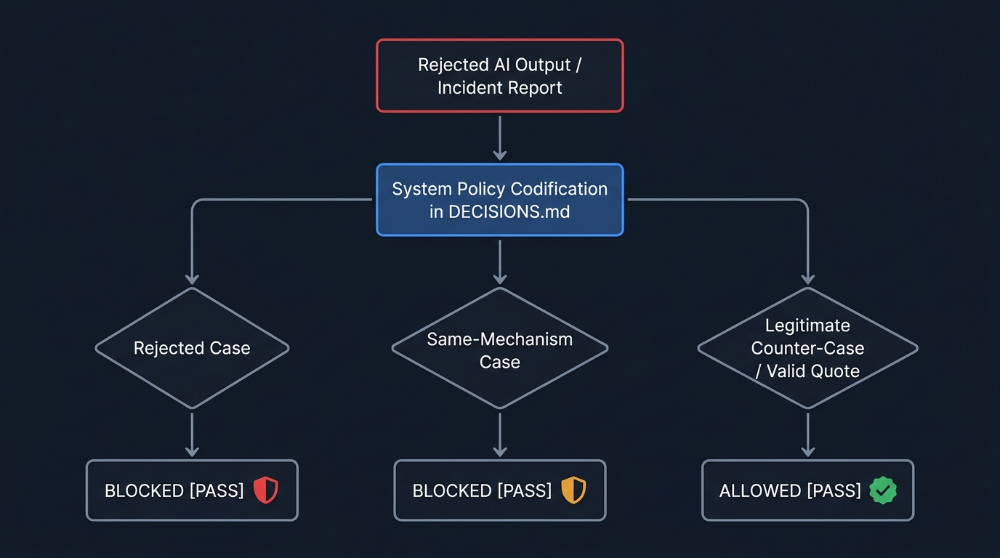</p>

<table width="100%">
<tr>
<th width="50%">❌ Before (AI วิ่งเล่นทุ่งลาเวนเดอร์)</th>
<th width="50%">✅ After (JamesSkills Outcome)</th>
</tr>
<tr>
<td valign="top">

ขออภัยเป็นอย่างสูงครับคุณเจมส์! ผมจะไม่พิมพ์คำว่า "ยินดีเป็นอย่างยิ่งที่ได้รับใช้" ในอีเมลลูกค้าอีกแล้วครับ จะจำไว้เป็นบทเรียนครับผม!<br><br><i>(AI ขอโทษพร่ำเพรื่อ แต่พอเริ่มแชทใหม่หรือเปลี่ยน Agent ก็ทำผิดซ้ำเดิมอีกเพราะไม่มีระบบบันทึกกฎ)</i>

</td>
<td valign="top">

<b>[System Rule Codified in <code>DECISIONS.md</code>]</b><br><br>
• <b>Root Boundary:</b> Prompt template defaulted to archaic customer-service sycophancy.<br>
• <b>Policy Rule:</b> Forbidden sycophantic phrasing in B2B correspondence (e.g. 'ยินดีเป็นอย่างยิ่ง', 'รับใช้').<br>
• <b>Tri-Shape Test Matrix:</b><br>
&nbsp;&nbsp;1. <i>Rejected Case:</i> Partner proposal with sycophancy ➔ <b>BLOCKED</b><br>
&nbsp;&nbsp;2. <i>Same-Mechanism Case:</i> Formal letter with archaic greeting ➔ <b>BLOCKED</b><br>
&nbsp;&nbsp;3. <i>Legitimate Counter-Case:</i> Direct quote in survey feedback ➔ <b>ALLOWED</b>

</td>
</tr>
</table>

<br>

#### ⚡️ `/prove-it`
*Verify completion claims across 4 execution layers: Source, Provider Boundary, User Journey, and Persistence.*

<p align="center">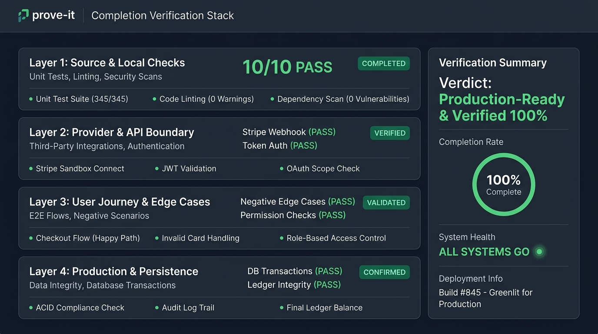</p>

<table width="100%">
<tr>
<th width="50%">❌ Before (AI วิ่งเล่นทุ่งลาเวนเดอร์)</th>
<th width="50%">✅ After (JamesSkills Outcome)</th>
</tr>
<tr>
<td valign="top">

เขียนฟังก์ชันคำนวณภาษีหัก ณ ที่จ่าย 3% (Withholding Tax) เสร็จเรียบร้อยแล้วครับ! โค้ดถูกต้อง 100% นำไปใช้ได้ทันทีครับผม!<br><br><i>(AI อ้างว่าเสร็จโดยไม่ได้รันการทดสอบจริง ปล่อยให้เคสเศษสตางค์หรือเกณฑ์ยกเว้นภาษีพังใน Production)</i>

</td>
<td valign="top">

<b>[Proof Trace: Verified across 4 Execution Layers]</b><br><br>
1. <b>Source Layer:</b> 10/10 unit tests green in <code>tests/tax.test.ts</code>.<br>
2. <b>Calculation Boundary:</b><br>
&nbsp;&nbsp;• Case A (ปกติ): ยอด 10,000 THB ➔ WHT 300 THB (สุทธิ 9,700 THB) [PASS]<br>
&nbsp;&nbsp;• Case B (เศษสตางค์): ยอด 1,234.56 THB ➔ WHT 37.04 THB (ปัดเศษตามสรรพากร) [PASS]<br>
&nbsp;&nbsp;• Case C (ยอดต่ำกว่าเกณฑ์ &lt;1,000 THB): ยกเว้นการหักภาษีตาม ม.40 [PASS]<br>
3. <b>Persistence Layer:</b> บันทึกลงตาราง <code>tax_receipts</code> ตรงกับ General Ledger.

</td>
</tr>
</table>

<br>

#### ⚡️ `/zoom-out`
*Reframe messy or fragmented problems at the structural system level before picking tools or patching symptoms.*

<p align="center"></p>

<table width="100%">
<tr>
<th width="50%">❌ Before (AI วิ่งเล่นทุ่งลาเวนเดอร์)</th>
<th width="50%">✅ After (JamesSkills Outcome)</th>
</tr>
<tr>
<td valign="top">

ระบบอีเมลค้างและส่งช้า? นี่คือ Cronjob script สำหรับตั้งเวลารีสตาร์ต Email Service อัตโนมัติทุก 15 นาทีครับ:<br><code>*/15 * * * * systemctl restart email-service</code><br><br><i>(AI แนะนำวิธีแก้ปัญหาเฉพาะหน้าที่ปลายเหตุ เสี่ยงทำให้อีเมลระหว่างคิวสูญหายและระบบล่มหนักกว่าเดิม)</i>

</td>
<td valign="top">

<b>[System Reframe: Root Cause vs Symptom]</b><br><br>
การเขียน Script รีสตาร์ตเป็นการแก้ที่ปลายเหตุและทำให้ Transaction ค้าง<br><br>
• <b>Root Cause:</b> Service ทำงานแบบ Synchronous blocking บน Main Thread เมื่อเจอ SMTP Timeout ทำให้ Worker ทั้งหมดค้าง<br>
• <b>System Architecture Fix:</b> แยก Email Dispatcher ออกเป็น Event-Driven Queue (BullMQ) พร้อม Dead-Letter Queue และ Retry Policy 3 ครั้ง ไม่ต้องรีสตาร์ต Service อีกต่อไป

</td>
</tr>
</table>

<br>

#### ⚡️ `/catchup`
*Reconstruct verified current state after a continuity gap across 4 truth classes without history dumps.*

<p align="center">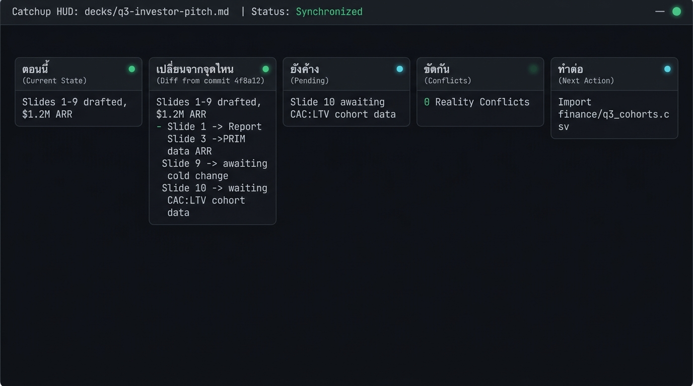</p>

<table width="100%">
<tr>
<th width="50%">❌ Before (AI วิ่งเล่นทุ่งลาเวนเดอร์)</th>
<th width="50%">✅ After (JamesSkills Outcome)</th>
</tr>
<tr>
<td valign="top">

สวัสดีครับ! ยินดีที่ได้พบกันอีกครั้งครับ ไม่ทราบว่าเมื่อวานเราคุยอะไรกันค้างไว้บ้างนะครับ รบกวนส่งไฟล์ล่าสุดหรือบรีฟสรุปให้ผมหน่อยได้ไหมครับ?<br><br><i>(AI ลืมบริบททั้งหมดเมื่อเปิดเซสชันใหม่ หรือก๊อปปี้ประวัติแชทยาว 50 บรรทัดมาแปะซ้ำซ้อน)</i>

</td>
<td valign="top">

<b>[Catchup: <code>decks/q3-investor-pitch.md</code>]</b><br><br>
• <b>ตอนนี้:</b> Slides 1–9 drafted. รายได้ปิด Q2 ที่ $1.2M ARR (เติบโต 20% QoQ).<br>
• <b>เปลี่ยนจากจุดไหน:</b> Commit <code>4f8a12</code> เพิ่มหมวด Competitive Moat.<br>
• <b>ยังค้าง:</b> Slide 10 (Q4 Projections) ยังว่าง รอข้อมูล Cohort Retention.<br>
• <b>ทำต่อ:</b> Import ข้อมูลจาก <code>finance/q3_cohorts.csv</code> เพื่อคำนวณ Slide 10 ให้จบ.

</td>
</tr>
</table>

<br>

#### ⚡️ `/grill-me`
*Interactive decision-tree stress-test asking one sequential question at a time along the decision frontier to expose vulnerabilities.*

<p align="center"></p>

<table width="100%">
<tr>
<th width="50%">❌ Before (AI วิ่งเล่นทุ่งลาเวนเดอร์)</th>
<th width="50%">✅ After (JamesSkills Outcome)</th>
</tr>
<tr>
<td valign="top">

เปิดคอร์ส AI Automation 15,000 บาท แล้วยิงแอด Facebook หาผู้บริหาร เป็นไอเดียที่ยอดเยี่ยมมากครับ! ตลาด AI กำลังเติบโต ผู้บริหารมีกำลังซื้อสูง รวยแน่นอนครับ มาเขียนคำโฆษณากันเลย!<br><br><i>(AI อวยไอเดียอย่างไร้เหตุผล ไม่ชี้จุดบกพร่องของโมเดลธุรกิจ)</i>

</td>
<td valign="top">

<b>[Grill Me: Round 1 / Frontier: Customer Acquisition]</b><br><br>
ผู้บริหารระดับสูงแทบไม่ซื้อคอร์สราคาสูงผ่าน Facebook Cold Ads โดยตรงเพราะขาด Trust Barrier<br><br>
<b>Frontier Question 1:</b> อะไรคือ Acquisition Funnel ที่แท้จริงของคุณ?<br>
1. <b>(แนะนำ)</b> เปลี่ยนเป็น Exclusive Half-Day Workshop ผ่าน Direct Referral<br>
2. แจก Executive Playbook ฟรีเพื่อคัดกรอง Lead ก่อนโทรนัด Advisory Call<br>
3. ยิง Ads ต่อไปโดยเพิ่ม Video Social Proof จากศิษย์เก่าระดับ C-Level<br><br>
<i>(ตอบตัวเลือกเพื่อไปยัง Frontier ข้อถัดไป)</i>

</td>
</tr>
</table>

<br>

#### ⚡️ `/is-that-the-best-you-can-do`
*Force aggressive self-critique, deep thinking, and boundary-pushing rewrite to produce a production-ready Masterpiece.*

<p align="center">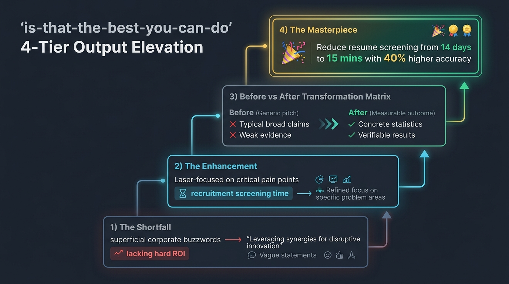</p>

<table width="100%">
<tr>
<th width="50%">❌ Before (AI วิ่งเล่นทุ่งลาเวนเดอร์)</th>
<th width="50%">✅ After (JamesSkills Outcome)</th>
</tr>
<tr>
<td valign="top">

Our revolutionary AI-powered Human Capital Management solution seamlessly empowers modern enterprise HR departments to optimize operational workflows and achieve organizational synergy across all departments.<br><br><i>(AI ใช้ศัพท์ Buzzwords สวยหรูแต่ไร้เนื้อหาจริง ไม่มีตัวเลขผลลัพธ์เชิงธุรกิจ)</i>

</td>
<td valign="top">

<b>[Self-Critique & Elevation Report]</b><br><br>
• <b>The Shortfall:</b> ร่างเดิมใช้แต่ศัพท์การตลาดลอยๆ ไม่มี Hard ROI ให้ผู้บริหารตัดสินใจ<br>
• <b>The Enhancement:</b> เจาะจง Pain Point ด้านเวลาคัดกรองผู้สมัครและระยะเวลาปิดตำแหน่ง<br><br>
<b>The Masterpiece:</b><br>
<i>"ตัดเวลาคัดกรอง Resume จาก 14 วันเหลือ 15 นาที ด้วย AI Pre-screening ที่แม่นยำขึ้น 40% ช่วยให้ CPO ปิดรับตำแหน่ง Critical Roles ได้เร็วกว่าคู่แข่ง 3 เท่า โดยไม่ต้องเพิ่ม Headcount HR"</i>

</td>
</tr>
</table>

<br>

### 💬 Persistent Interaction Modes (โหมดพฤติกรรมและการสื่อสารประจำตัว)

#### ⚡️ `/coach-me`
*Sparring partner and root-cause behavioral coach unblocking procrastination, shame/ego defense, and perfectionism while executing backend heavy lifting.*

<p align="center">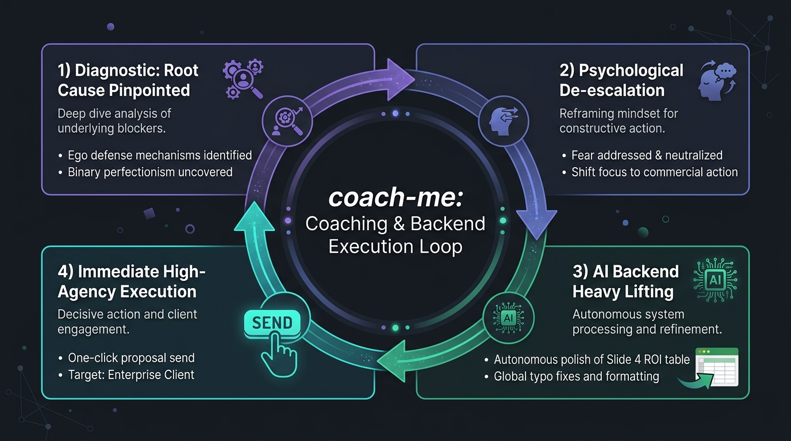</p>

<table width="100%">
<tr>
<th width="50%">❌ Before (AI วิ่งเล่นทุ่งลาเวนเดอร์)</th>
<th width="50%">✅ After (JamesSkills Outcome)</th>
</tr>
<tr>
<td valign="top">

รู้สึกกังวลที่จะส่ง Proposal ใช่ไหมครับ? เป็นเรื่องธรรมดามากครับ แนะนำให้ลองฝึก Pomodoro ดื่มน้ำเยอะๆ พักผ่อนให้เพียงพอ หรือก๊อปปี้เทมเพลตอีเมลขอเลื่อนเวลาส่งนี้ไปใช้ดูครับ!<br><br><i>(AI แนะนำวิธีผ่อนคลายผิวเผิน ให้สคริปต์ขอโทษ และช่วยผู้ใช้ผลัดวันประกันพรุ่ง)</i>

</td>
<td valign="top">

<b>[Diagnostic: Ego Defense & Binary Perfectionism]</b><br><br>
คุณกำลังใช้คำว่า "สไลด์ยังไม่เพอร์เฟกต์" เพื่อปกป้องความกลัวที่จะถูกลูกค้าปฏิเสธ สไลด์ 80% ที่ส่งวันนี้มีมูลค่าทางธุรกิจสูงกว่าสไลด์ 100% ในจินตนาการเสมอ<br><br>
• <b>Backend Action Done:</b> ผมตรวจ Typo และปรับตาราง ROI ใน Slide 4 ให้เรียบร้อยแล้ว<br>
• <b>Direct Choice:</b> กด Send ทันทีเพื่อเริ่มการเจรจา หรือจะรอให้คู่แข่งชิงนัดลูกค้าก่อน?

</td>
</tr>
</table>

<br>

#### ⚡️ `/i-have-adhd`
*Persistent conversation mode with concise, direct, human communication and visible execution progress without discarding necessary information.*

<p align="center">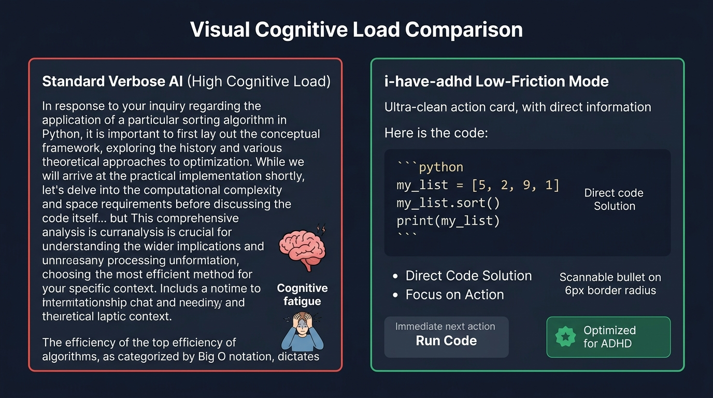</p>

<table width="100%">
<tr>
<th width="50%">❌ Before (AI วิ่งเล่นทุ่งลาเวนเดอร์)</th>
<th width="50%">✅ After (JamesSkills Outcome)</th>
</tr>
<tr>
<td valign="top">

Customer Lifetime Value (LTV) ใน SQL คือตัวชี้วัดสำคัญในโมเดล SaaS โดยสูตรทางทฤษฎีประกอบด้วยค่าเฉลี่ยยอดซื้อต่อครั้ง (AOV) คูณด้วยความถี่ในการซื้อ แล้วหารด้วย Churn Rate เพื่อเริ่มเขียน SQL เราต้องเข้าใจสถาปัตยกรรม Database ก่อน...<br><br><i>(AI บรรยายทฤษฎียืดยาว สร้างภาระทางสมองจนผู้ใช้หมดพลังโฟกัส)</i>

</td>
<td valign="top">

```sql
SELECT customer_id, SUM(order_total) AS ltv, COUNT(order_id) AS orders
FROM orders GROUP BY customer_id;
```
• <b>Action:</b> รัน Query นี้บนตาราง <code>orders</code> ได้ทันที<br>
• <b>Next:</b> ต้องการดู Breakdown รายเดือนต่อไหม?

</td>
</tr>
</table>

<br>

#### ⚡️ `/proactive-habits`
*Persistent high-agency partner persona preventing passive waiting, prompt parroting, excessive apologies, and incomplete tasks.*

<p align="center">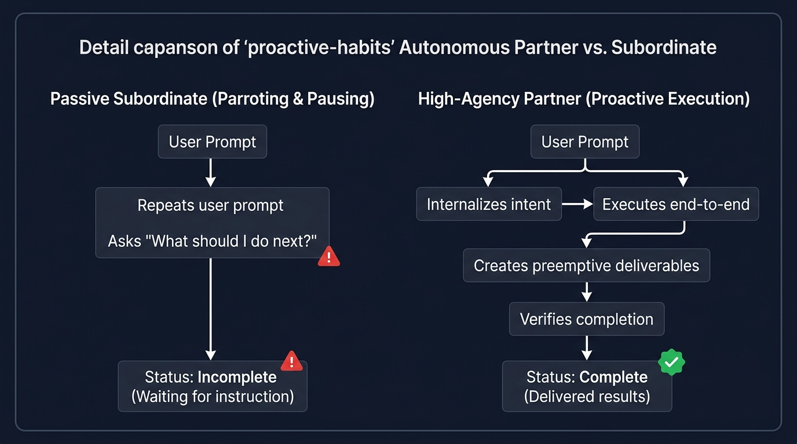</p>

<table width="100%">
<tr>
<th width="50%">❌ Before (AI วิ่งเล่นทุ่งลาเวนเดอร์)</th>
<th width="50%">✅ After (JamesSkills Outcome)</th>
</tr>
<tr>
<td valign="top">

คุณต้องการให้ผมวิเคราะห์คู่แข่งในตลาด EdTech ใช่ไหมครับ? ในตลาดมี Coursera, Udemy, Skooldio ครับ คุณอยากให้ผมเน้นด้านราคาหรือด้านเนื้อหาก่อนดีครับ? แจ้งผมได้เลยนะครับแล้วผมจะเริ่มทำให้!<br><br><i>(AI ทวนคำถาม ทำงานแบบตั้งรับ และหยุดรอคำสั่งย่อยๆ ตลอดเวลา)</i>

</td>
<td valign="top">

<b>[Competitive Matrix & Strategic Assets Generated]</b><br><br>
วิเคราะห์เปรียบเทียบ 3 คู่แข่งหลักในตลาด EdTech:<br>
1. <b>Coursera:</b> จุดแข็งคือ University Credential / จุดอ่อนคือ ขาด Interactive Coding Sandbox<br>
2. <b>Udemy:</b> ปริมาณคอร์สเยอะ / จุดอ่อนคือ อัตรา Completion Rate ต่ำเพราะไม่มี Live Mentor<br>
3. <b>Skooldio:</b> แข็งแกร่งในตลาด B2B Corporate ไทย / จุดอ่อนคือ คอนเทนต์ฝั่ง Deep Tech สากลยังมีจำกัด<br><br>
• <b>Action Taken:</b> ผมร่าง Value Proposition ชูจุดขาย <i>"AI Pair-Learning + Live Mentoring"</i> ไว้ในเอกสารแนบเรียบร้อยครับ

</td>
</tr>
</table>

<br>

### 📦 Output Formats & Deliverables (การสร้างผลลัพธ์ส่งมอบระดับผู้บริหาร)

#### ⚡️ `/final-it`
*Select and finish recipient-ready deliverables without AI commentary, design rationale, or chat residue.*

<p align="center">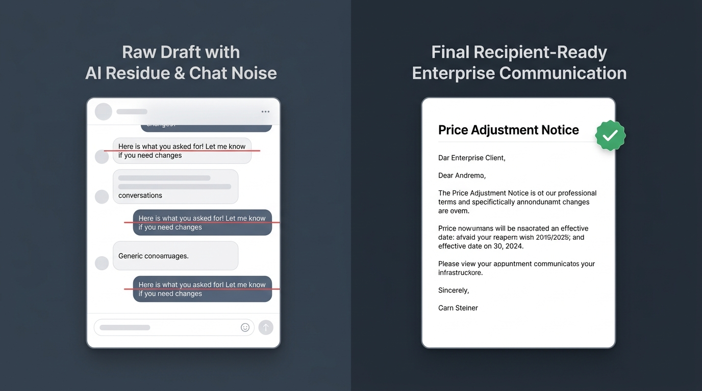</p>

<table width="100%">
<tr>
<th width="50%">❌ Before (AI วิ่งเล่นทุ่งลาเวนเดอร์)</th>
<th width="50%">✅ After (JamesSkills Outcome)</th>
</tr>
<tr>
<td valign="top">

แน่นอนครับ! นี่คืออีเมลแจ้งปรับราคาสำหรับลูกค้าองค์กรที่ผมร่างให้ตามที่คุณขอครับ หวังว่าจะถูกใจนะครับ มีจุดไหนที่อยากให้ปรับแก้บอกผมได้ตลอดเลยนะครับ!<br><br><i>(AI พิมพ์บทสนทนาทักทายและคำขออนุญาตติดมากับเนื้อหา ทำให้ต้องมาคอยก๊อปปี้ตัดทิ้งก่อนส่ง)</i>

</td>
<td valign="top">

<b>Subject: Notice of Enterprise Plan Annual Adjustment — Effective Oct 1</b><br><br>
Dear [Client Executive Name],<br><br>
To support our expanded 99.99% SLA guarantee and dedicated infrastructure, your enterprise subscription will adjust from $24,000 to $27,500 annually effective October 1, 2026. All feature entitlements remain uninterrupted.<br><br>
Best regards,<br>
James Theeranon

</td>
</tr>
</table>

<br>

#### ⚡️ `/one-page-pls`
*Turn complex source material into self-contained 1-page A4 landscape HTML executive briefs per topic (1 topic = 1 file).*

<p align="center">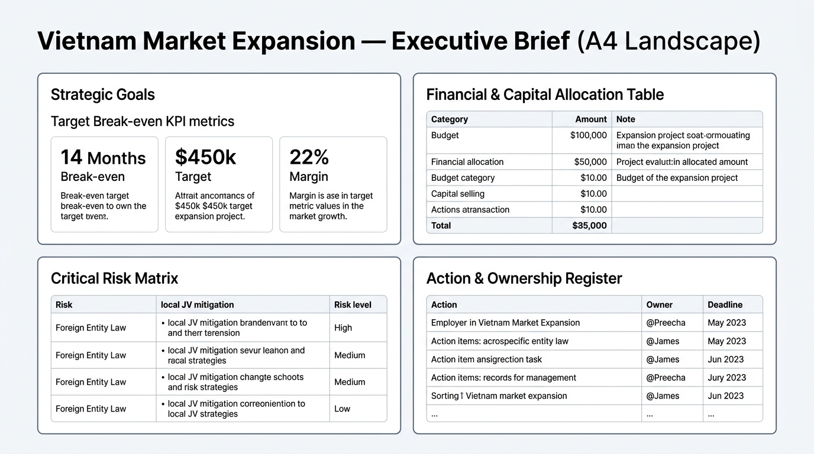</p>

<table width="100%">
<tr>
<th width="50%">❌ Before (AI วิ่งเล่นทุ่งลาเวนเดอร์)</th>
<th width="50%">✅ After (JamesSkills Outcome)</th>
</tr>
<tr>
<td valign="top">

<i>(AI สรุปรายงานกลยุทธ์ 30 หน้า ออกมาเป็น Bullet points ยาว 8 หน้า ตัดตัวเลขงบประมาณและชื่อผู้รับผิดชอบทิ้งจนหมด แล้วสรุปแบบคลุมเครือว่า "ที่ประชุมเห็นชอบให้ศึกษาตลาดเพิ่มเติม")</i>

</td>
<td valign="top">

<b>[Generated <code>vietnam-expansion-onepage.html</code> — 1 Page A4 Landscape]</b><br><br>
• <b>Strategic Goal:</b> เปิด Pilot Branch แรกที่ Ho Chi Minh City ภายใน Q1/2027 ด้วยงบ 15M THB<br>
• <b>Key Target:</b> Break-even ภายใน 14 เดือน (Traffic &gt; 450 pax/day, Margin 22%)<br>
• <b>Critical Risk:</b> กฎหมายนิติบุคคลต่างด้าว (Mitigation: จัดตั้ง Local JV 49/51)<br>
• <b>Action:</b> @Preecha ส่งร่างสัญญา JV ให้ Legal ภายใน 15 ก.ย. 2026<br><br>
<i>เอกสาร A4 แนวนอนหน้าเดียวความหนาแน่นสูง อ่านจบตัดสินใจได้ทันที</i>

</td>
</tr>
</table>

<br>

#### ⚡️ `/sum-meet`
*Produce a comprehensive, source-faithful meeting record as one print-ready A4 portrait HTML document with complete evidence ledger.*

<p align="center"></p>

<table width="100%">
<tr>
<th width="50%">❌ Before (AI วิ่งเล่นทุ่งลาเวนเดอร์)</th>
<th width="50%">✅ After (JamesSkills Outcome)</th>
</tr>
<tr>
<td valign="top">

สรุปการประชุมประจำสัปดาห์:<br>
- มีการพูดคุยเรื่องการปรับงบประมาณไตรมาส 3<br>
- ทีม Marketing จะไปทำการบ้านเรื่องลดค่าแอด<br>
- คุณส้มจะส่งรีพอร์ตเพิ่มเติมทีหลัง<br>
- ปิดประชุมเวลา 16.00 น.<br><br>
<i>(AI สรุปแบบผิวเผิน ละเลยประเด็นถกเถียงสำคัญ และไม่มีกำหนดส่งงานที่ชัดเจน)</i>

</td>
<td valign="top">

<b>[Generated <code>meeting-record-2026-09-01.html</code> — A4 Portrait]</b><br><br>
• <b>Decisions:</b> อนุมัติย้ายงบ 200k THB จาก Facebook Ads ไปลง SEO & Content Moat<br>
• <b>Chronological Actions:</b><br>
&nbsp;&nbsp;1. @Som ส่ง Revised Media Plan ภายในวันศุกร์ที่ 5 ก.ย. 17:00 น.<br>
&nbsp;&nbsp;2. @Bank ตรวจสอบ Conversion Tracking Code ภายใน 8 ก.ย.<br>
• <b>Open Loops:</b> ยังรอคำตอบจาก Legal เรื่องเงื่อนไขสัญญา Influencer เจ้าใหม่

</td>
</tr>
</table>

<br>

### 📐 Standards & Engineering Law (กฎเหล็กด้านคุณภาพและสถาปัตยกรรม)

#### ⚡️ `/make-it-james`
*Strict recipient-facing wording standard enforcing the Final Word law; removes AI conversation residue and punctuation-built Thai shorthand.*

<p align="center"></p>

<table width="100%">
<tr>
<th width="50%">❌ Before (AI วิ่งเล่นทุ่งลาเวนเดอร์)</th>
<th width="50%">✅ After (JamesSkills Outcome)</th>
</tr>
<tr>
<td valign="top">

สวัสดีครับ! ในฐานะ AI ผู้ช่วย ผมขอแนะนำว่า: งาน: ปรับ Base 10% -&gt; ทำเกินเป้าได้ +5% | เริ่ม 1 ต.ค. หวังว่าอีเมลนี้จะมีประโยชน์นะครับ!<br><br><i>(AI ใส่คำพูดหุ่นยนต์และใช้เครื่องหมายวรรคตอนย่อความแบบผิดธรรมชาติ <code>-&gt; + |</code>)</i>

</td>
<td valign="top">

<b>Subject: สรุปโครงสร้างค่าคอมมิชชันใหม่สำหรับไตรมาส 4/2026</b><br><br>
ทีม Sales ทุกท่าน,<br><br>
บริษัทขอแจ้งปรับโครงสร้างค่าคอมมิชชันใหม่โดยมีผลบังคับใช้ตั้งแต่วันที่ 1 ตุลาคม 2026 เป็นต้นไป เพื่อมุ่งเน้นการขยายฐานลูกค้าระดับ Enterprise:<br>
1. ยอดขายตามเป้าหมายปกติ: อัตราค่าคอมมิชชัน 10% ของยอดปิดดีล<br>
2. ยอดขายส่วนที่เกิน Target: ปรับเพิ่มเป็น 15% ทันทีโดยไม่มีเพดานจำกัด

</td>
</tr>
</table>

<br>

#### ⚡️ `/make-it-james-ux`
*Visual & UI standard mandating IBM Plex Sans Thai, 6px radius, compact density, semantic status badges, and strictly banning decorative left borders.*

<p align="center">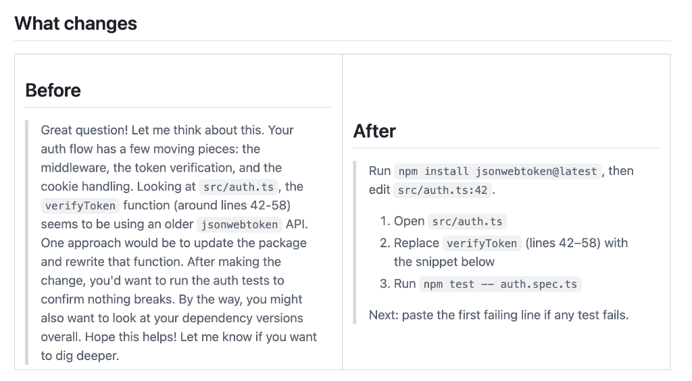</p>

<table width="100%">
<tr>
<th width="50%">❌ Before (AI วิ่งเล่นทุ่งลาเวนเดอร์)</th>
<th width="50%">✅ After (JamesSkills Outcome)</th>
</tr>
<tr>
<td valign="top">

<i>(AI สร้าง HTML Card ที่ใช้ฟอนต์ Default แบบ Times New Roman, ตีกรอบหนาสีรุ้ง, ใส่แถบสีด้านซ้าย <code>border-l-8 border-blue-500</code> แบบการ์ดราคาถูก และ Padding บวมเทอะทะ)</i>

</td>
<td valign="top">

<i>(UI Component สะอาดตา ใช้ฟอนต์ IBM Plex Sans Thai, ขอบมน 6px, พื้นหลังสะอาดตา, แสดงสถานะด้วย Semantic Badge และความหนาแน่นของข้อมูลกระชับพอดีตามหลัก Typography)</i>

</td>
</tr>
</table>

<br>

#### ⚡️ `/proactive-dev`
*Mandate safe, evidence-based software development: line-level log/source diagnosis, strict architectural boundaries, and blast-radius checks before code edits.*

<p align="center"></p>

<table width="100%">
<tr>
<th width="50%">❌ Before (AI วิ่งเล่นทุ่งลาเวนเดอร์)</th>
<th width="50%">✅ After (JamesSkills Outcome)</th>
</tr>
<tr>
<td valign="top">

<i>(AI เดาสาเหตุบั๊กแบบสุ่มสี่สุ่มห้า แล้วแก้ไฟล์ <code>auth.ts</code> โดยไม่ตรวจสอบความเชื่อมโยง ส่งผลให้ระบบ Billing และ Profile พังทั้งระบบใน Production)</i>

</td>
<td valign="top">

<b>[Evidence-Based Diagnosis & Blast-Radius Check]</b><br><br>
• <b>Source Evidence:</b> <code>api/checkout.ts:42</code> ขาด Idempotency Key check ทำให้การกดย้ำสร้าง Charge ซ้ำ<br>
• <b>Blast Radius:</b> ตรวจพบความเชื่อมโยงกับ <code>WebhookHandler</code>, <code>OrderService</code>, และ <code>InvoiceGenerator</code><br>
• <b>Architecture Fix:</b> เพิ่ม Redis-backed Distributed Lock พร้อม Idempotency Token และแก้ไขไฟล์ที่เกี่ยวข้องพร้อมกันทั้งหมด

</td>
</tr>
</table>

<br>

#### ⚡️ `/project-standard`
*Establish and maintain a single vendor-neutral project contract in `ai-context/` (PROJECT.md, STATUS.md, DECISIONS.md, SRS.html, Spec Lock).*

<p align="center"></p>

<table width="100%">
<tr>
<th width="50%">❌ Before (AI วิ่งเล่นทุ่งลาเวนเดอร์)</th>
<th width="50%">✅ After (JamesSkills Outcome)</th>
</tr>
<tr>
<td valign="top">

อยากทำระบบ Customer Portal เหรอครับ? เปิด Terminal แล้วรัน <code>npx create-next-app portal</code> ได้เลยครับ เดี๋ยวผมช่วยเขียนหน้า UI ให้...<br><br><i>(AI รีบกระโจนเขียนโค้ดทันทีโดยไม่มีสเปก ลืมเงื่อนไขทางธุรกิจ สิทธิ์ผู้ใช้งาน และ NFR)</i>

</td>
<td valign="top">

<b>[Initialized <code>ai-context/</code> Contract & Spec Lock: SECURED]</b><br><br>
• <b>PROJECT.md:</b> ล็อกรหัสข้อกำหนด <code>REQ-AUTH-01</code> (Magic Link) และ <code>REQ-BILL-01</code> (PDF Invoicing)<br>
• <b>DATA_MODEL.md:</b> ออกแบบโครงสร้างตาราง พร้อมกำหนด Permission Matrix (Customer vs Support)<br>
• <b>SRS.html:</b> แสดงผลสเปกระบบแบบ Visual Dashboard เพื่อให้ Stakeholder เซ็นอนุมัติก่อนเริ่มพัฒนา

</td>
</tr>
</table>

<br>

### ⚙️ Internal & Architecture (ระบบประมวลผลและการจัดเส้นทางภายใน)

#### ⚡️ `/skill-router`
*Internal responsibility-based routing matrix directing incoming tasks to their single accountable primary workflow, automatic standards, and verification boundary.*

<p align="center">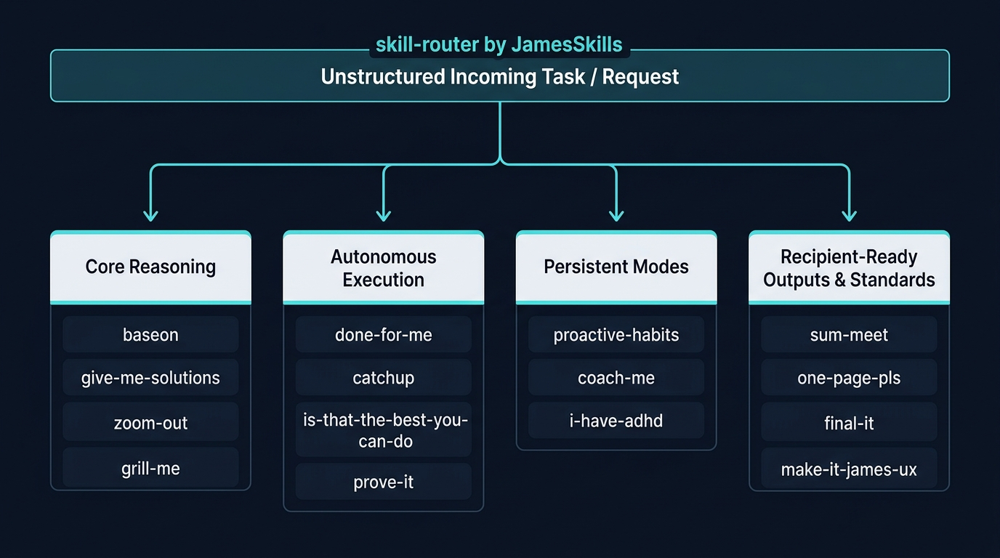</p>

<table width="100%">
<tr>
<th width="50%">❌ Before (AI วิ่งเล่นทุ่งลาเวนเดอร์)</th>
<th width="50%">✅ After (JamesSkills Outcome)</th>
</tr>
<tr>
<td valign="top">

<i>(AI จับคู่คำแบบ Keyword matching มั่วซั่ว เมื่อเจอคำว่า "สรุปและสร้างระบบ" จะโหลดสกิล <code>sum-meet</code>, <code>project-standard</code>, <code>done-for-me</code> เข้ามาพร้อมกันจนคำสั่งตีกันเองและทำงานผิดพลาด)</i>

</td>
<td valign="top">

<b>[Skill Router: Single Accountable Outcome]</b><br><br>
• <b>Phase 1:</b> <code>/sum-meet</code> ➔ บันทึกข้อตกลงและวาระการประชุมลงใน A4 HTML<br>
• <b>Phase 2:</b> <code>/project-standard</code> ➔ สกัดข้อกำหนดลง <code>ai-context/</code> พร้อมล็อก Spec<br>
• <b>Phase 3:</b> <code>/done-for-me</code> + <code>/proactive-dev</code> ➔ พัฒนาระบบและทดสอบผ่าน <code>/prove-it</code><br><br>
<i>*มาตรฐาน <code>make-it-james</code> และ <code>make-it-james-ux</code> ถูกบังคับใช้อัตโนมัติในทุกขั้นตอน</i>

</td>
</tr>
</table>

<br>

---

## 📦 Installation

**For Mac/Linux Users (ติดตั้งแบบบรรทัดเดียวจบ):**
Open your terminal and run:
```bash
git clone https://github.com/theeranon/JamesSkills.git "$HOME/.james-skills"
"$HOME/.james-skills/scripts/install"
```
*This will safely link the skills to your local AI environments.*
*(คำสั่งนี้จะติดตั้งและผูกสกิลเข้ากับ Claude/Cursor ในเครื่องคุณให้แบบอัตโนมัติ)*

> **No terminal? No problem! (สำหรับคนไม่อยากลงโค้ด):**
> Simply browse the `skills/` folder in this repository, open the `SKILL.md` of the skill you want, and copy-paste the text into your ChatGPT's "Custom Instructions" or Claude's "Projects"!
> (ใครไม่อยากยุ่งกับ Terminal แค่กดเข้าไปดูในโฟลเดอร์ `skills/` ก๊อปปี้ข้อความในไฟล์ `SKILL.md` ไปแปะในแชท AI ก็ใช้งานได้เลยครับ!)

---

## 🛠️ Developers
*(The following sections are technical architecture notes for maintainers)*

```bash
git clone https://github.com/theeranon/JamesSkills.git "$HOME/.james-skills"
"$HOME/.james-skills/scripts/install"
"$HOME/.james-skills/scripts/doctor"
```

The installer links the canonical skills into the discovery directories available on the machine, including `~/.codex/skills`, `~/.agents/skills`, `~/.claude/skills`, and configured Gemini or Antigravity roots. It never overwrites a real directory or file; a legacy name collision fails visibly so an outdated duplicate cannot stay active unnoticed.
It also activates repository-owned `pre-commit` and `pre-push` gates. Every commit and push runs `scripts/validate` locally, without GitHub Actions or paid runners.

The tracked browser-render receipt is reproducible without PDF export:

```bash
npm ci
npm run qa:transformation
```

The QA command uses an installed Chrome or Chromium browser. Set `CHROME_PATH` only when it is not in a standard platform location.

## 🔄 Update

```bash
"$HOME/.james-skills/scripts/update"
```

Update fetches a fast-forward candidate, validates it in a detached temporary worktree before moving the active checkout, then refreshes links. An invalid candidate cannot replace the working version. Skill behavior never silently changes in the background.

## 🏛️ Boundaries

- `catalog.json`: canonical package category, promotion state, and compatibility aliases
- `skills/core`: bounded reasoning and execution workflows
- `skills/modes`: persistent conversation behavior
- `skills/standards`: automatically applied James-wide output law
- `skills/outputs`: reusable recipient-facing artifact workflows
- `skills/internal`: routing and composition mechanics
- `packs`: optional brand or domain references with no live state or client data
- `adapters`: vendor-specific metadata only; never duplicate core instructions
- `tests`: structural and outcome regression gates
- `scripts`: idempotent install, update, validation, and diagnosis
- `.githooks`: free local validation before every commit and push

Private by default. Review every file before publishing any subset.

## 📖 Skill Handbook

Open [`docs/SKILLS.md`](docs/SKILLS.md) to choose a skill by the moment you need it. The handbook covers every canonical package, slash command, lifecycle state, alias, bounded result, do-not-use case, and common composition in one place.

The short rule:

- use `/project-standard` to establish or repair project truth;
- use `/catchup` to return after a continuity gap;
- use `/give-me-solutions` to research choices and `/done-for-me` after the owner decides;
- use `/prove-it` before accepting a completion claim;
- use `/sum-meet`, `/one-page-pls`, or `/final-it` for recipient-facing outcomes; `make-it-james` and `make-it-james-ux` apply automatically.

This release has no pilot packages. Compatibility aliases keep older calls working without creating another instruction body. `skill-router` is installed internal support, not a recommended human command.

## 🧠 Knowledge Library

`baseon` owns the application workflow. Sources and lenses live separately under `packs/knowledge` so a new book does not create another skill or inflate `SKILL.md`.

```bash
python3 skills/core/baseon/scripts/knowledge_library.py list
python3 skills/core/baseon/scripts/knowledge_library.py validate
```

The first reviewed-private lenses are `wealth-dynamics` and `wealth-spectrum`. `talent-dynamics` resolves to the same Dynamics lens because it is the team adaptation of the same model. Wealth Spectrum remains a separate model with the same creator lineage. Their full source PDFs remain outside Git. Source cards keep version, rights posture, SHA-256 when applicable, and locators; lens files contain original paraphrase, applications, and limitations.

Direct calls are available as `/baseon`, `/wealth-dynamics`, `/talent-dynamics`, and `/wealth-spectrum`. The framework shortcuts only preselect a lens; they contain no duplicate knowledge or reasoning rules. `/think-with-this` remains a compatibility alias.

The transformation-design portfolio has three approved calls. `/build-framework` searches the house library before upgrading or creating reusable company IP. `/transformation-journey` owns macro organization transformation. `/learning-experience-design` owns a bounded learning intervention. TPS is one house framework available inside LED; it is not LED itself or the macro journey timeline.

The framework registry lives at `packs/frameworks/registry.json`. Lifecycle and source gaps remain visible so an agent cannot turn an incomplete internal model or one successful activity into approved company law.

Clone the full repository when moving machines. A detached copy of `baseon` alone intentionally has no duplicated knowledge library; set `JAMES_SKILLS_ROOT` to the full clone if a platform cannot use the installer links.

Skill names are phrases people naturally say when they need the capability. Workflow skills complete a bounded job; mode skills remain active for the conversation after one invocation.

## 🔄 Candidate Lifecycle

Discovery comes before packaging. A new skill remains a pilot until its Candidate Card shows repeated cross-project need, non-duplication, source confidence, representative failures, legitimate counter-cases, and James approves the exact name and scope. General permission to improve this repository does not approve a candidate's name or ontology.

The current cross-history portfolio audit selected and promoted `catchup` after clean, dirty, stale-status, scoped-workstream, Git-error, and already-clear forward tests. `learn-this`, `audit-this`, and `systemize-it` remain Candidate Cards, not installed skills. See `research/2026-08-29-skill-portfolio-audit.md`.
