# JamesSkills

Canonical workflows and prompts for AI collaboration. Designed for Claude, ChatGPT, Cursor, and Gemini.

## 🚀 Highlights

### 🎯 `/grill-me` (Interactive Stress-Test)
- **EN:** Challenge an idea. The AI asks sequential frontier questions to expose flaws and resolve dependencies before execution.
- **TH:** สั่งให้ AI ต้อนและซักถามจุดอ่อนในแผนงานทีละข้อ เพื่ออุดรอยรั่วก่อนลงมือทำจริง

### 💡 `/give-me-solutions` (Options & Trade-offs)
- **EN:** Research external options. Present objective tradeoffs and evidence matrices without making the final choice for the user.
- **TH:** วิเคราะห์และเปรียบเทียบข้อดีข้อเสียของแต่ละทางเลือก พร้อมตารางเปรียบเทียบต้นทุนและภาระงานอย่างตรงไปตรงมา

### 🔍 `/zoom-out` (System-Level Problem Solver)
- **EN:** Reframe a problem at the system and outcome level before picking tools or patching symptoms.
- **TH:** ถอยมามองภาพรวมระดับโครงสร้าง เพื่อค้นหาต้นตอที่แท้จริงแทนการแก้ปัญหาเฉพาะหน้าที่ปลายเหตุ

### 📝 `/one-page-pls` (Executive One-Pager)
- **EN:** Turn complex source material into one self-contained A4 landscape executive brief per topic.
- **TH:** สรุปเนื้อหาทั้งหมดให้อยู่ในหน้าเดียวแบบ A4 แนวนอน พร้อมตาราง KPI และแผนการดำเนินงานแยกตามวาระ

---


## 🏛️ Architecture: 3 Pillars, 22 Skills

The library ships as three Claude Code plugins, one per pillar. Each pillar owns one responsibility; no skill crosses pillar lines.

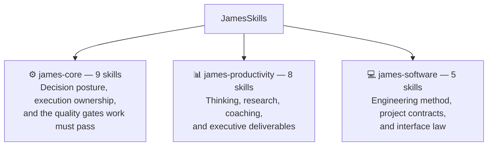

**⚙️ `james-core`** decides what to do and whether it was done right. It holds the mode that sets decision posture for a conversation (`proactive-habits`, `i-have-adhd`), the workflow that carries an agreed task to a finished outcome (`done-for-me`), the wording standard every recipient-facing output passes through (`make-it-james`), and the gates nothing ships without: `are-you-sure`, `research-it`, `is-that-the-best-you-can-do`, `never-again`, `hand-it-off`.

**📊 `james-productivity`** thinks before it builds. It sharpens a vague requirement (`grill-me`), reframes a problem at the system level (`zoom-out`), applies a registered knowledge lens (`baseon`), settles an open question against outside evidence combined with a candidate comparison (`give-me-solutions`), coaches a person through their own stuck point (`coach-me`), and produces the two recipient-facing formats this library ships (`sum-meet`, `one-page-pls`, `final-it`).

**💻 `james-software`** is engineering-specific: it plans and builds with role discipline (`proactive-dev`), sweeps delivered code across five layers and the deployment boundary (`dev-are-you-sure`), recovers verified project state after a gap (`catchup`), keeps one project contract instead of scattered chat history (`project-standard`), and enforces the visual and interaction law every rendered surface follows (`make-it-james-ux`).

Every skill in every pillar satisfies one structural contract, [`docs/SKILL-SCHEMA.md`](docs/SKILL-SCHEMA.md), enforced on every commit: what it owns, what it may change, the sibling that owns each case it refuses, when it stops, and the named principles it operates on.

**The anti-overfit gate.** Every skill lists the cases it refuses and names the sibling that owns each one. The validator builds a graph from those refusals and fails when any skill has nobody pointing at it, because a skill no sibling ever excludes toward does not have a distinct job. The current roster passes with 109 refusal edges across 22 skills.

## 📚 Full Skill Directory (Before vs After)

### 🎯 Core Execution & Reasoning Workflows (สกิลการคิด วิเคราะห์ และลงมือทำ)

#### ⚡️ `/done-for-me`
*Autonomous end-to-end authorized execution through verified completion without micromanagement.*

<p align="center">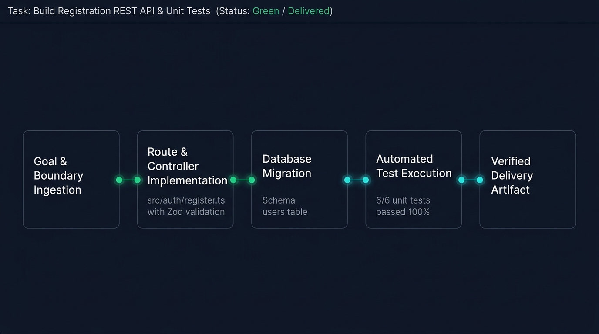</p>

<table width="100%">
<tr>
<th width="50%">❌ Before (ปล่อย AI ทำเอง)</th>
<th width="50%">✅ After (JamesSkills Outcome)</th>
</tr>
<tr>
<td valign="top">

I have created the initial `user.model.ts` file for your registration API. Would you like me to write the controller next? And which test framework do you prefer (Jest or Vitest)? Please let me know how you'd like to proceed!<br><br><i>(AI ทำงานทีละไฟล์แล้วหยุดถามทุกขั้นตอน สร้างภาระให้ผู้ใช้ต้องคอยคุมงานยิบย่อย)</i>

</td>
<td valign="top">

<b>[Execution Complete: User Registration API]</b><br><br>
1. <b>Controller & Validation:</b> Created <code>src/auth/register.ts</code> with Zod schema validation.<br>
2. <b>Database Migration:</b> Generated migration for <code>users</code> table with unique email index.<br>
3. <b>Automated Tests:</b> Created <code>tests/auth.test.ts</code> (6 unit & integration tests, 100% green).<br><br>
<i>ระบบพร้อม Deploy ทันทีโดยไม่ต้องคอยสั่งงานทีละสเต็ป</i>

</td>
</tr>
</table>

<br>

#### ⚡️ `/give-me-solutions`
*Research external options, build objective tradeoff matrices with user evidence, and recommend front-runners without usurping the user's decision.*

<p align="center">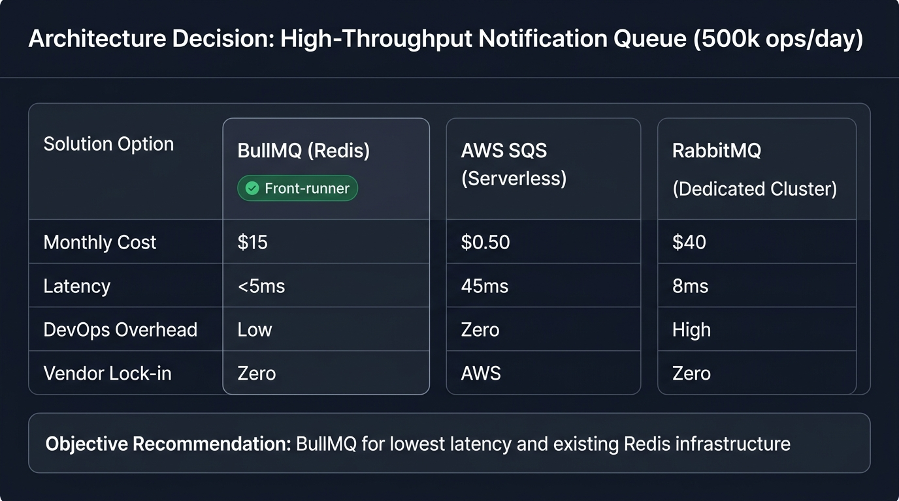</p>

<table width="100%">
<tr>
<th width="50%">❌ Before (ปล่อย AI ทำเอง)</th>
<th width="50%">✅ After (JamesSkills Outcome)</th>
</tr>
<tr>
<td valign="top">

AWS SQS is definitely the best option for your notification system! It is fully managed, serverless, and scales infinitely. RabbitMQ is too old and complicated. You should go with AWS SQS immediately!<br><br><i>(AI แนะนำเทคโนโลยีตามกระแสโดยไม่สนใจโจทย์ ต้นทุน หรือภาระงานบำรุงรักษาของทีม)</i>

</td>
<td valign="top">

<b>[Decision Matrix: Notification Queue for 500k ops/day]</b><br><br>
<table>
<tr><th>Option</th><th>Est. Cost</th><th>Pros & Tradeoffs</th></tr>
<tr><td><b>BullMQ (Redis)</b> <i>(Front-runner)</i></td><td>~$15/mo</td><td>Low latency (&lt;5ms), reuse existing Redis, minimal DevOps</td></tr>
<tr><td><b>AWS SQS</b></td><td>~$0.50 + compute</td><td>Zero maintenance, but higher polling latency</td></tr>
<tr><td><b>RabbitMQ</b></td><td>~$40/mo</td><td>Advanced routing, but high DevOps overhead for current team</td></tr>
</table><br>
• <b>Recommendation:</b> BullMQ if Redis is already running; AWS SQS for zero infrastructure maintenance.<br>
<i>*ทางเลือกสุดท้ายขึ้นอยู่กับการตัดสินใจของคุณ</i>

</td>
</tr>
</table>

<br>

#### ⚡️ `/baseon`
*Apply a named knowledge lens (Wealth Dynamics, Talent Dynamics, Wealth Spectrum) with strict 4-layer epistemic separation.*

<p align="center">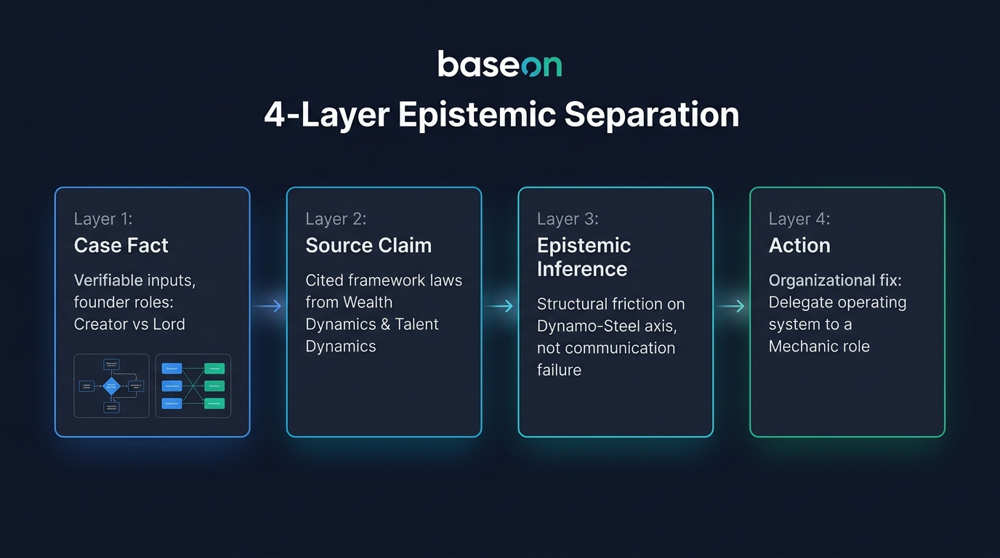</p>

<table width="100%">
<tr>
<th width="50%">❌ Before (ปล่อย AI ทำเอง)</th>
<th width="50%">✅ After (JamesSkills Outcome)</th>
</tr>
<tr>
<td valign="top">

To improve communication with your co-founder, you should practice active listening and empathy. จัดประชุม 1-on-1 ทุกสัปดาห์เพื่อแชร์ความรู้สึกและปรับความเข้าใจกันนะครับ!<br><br><i>(AI ตอบแบบจิตวิทยาผิวเผิน มองข้ามโครงสร้างบทบาทและรูปแบบการสร้างคุณค่าที่แท้จริง)</i>

</td>
<td valign="top">

<b>[Lens: Wealth Dynamics]</b><br><br>
• <b>Case Fact:</b> Creator (Focus on Idea/Speed) vs Lord (Focus on Cashflow/Control).<br>
• <b>Source Claim:</b> The Dynamo-Steel axis experiences natural structural friction in direct handoffs.<br>
• <b>Epistemic Inference:</b> Friction is structural, not emotional. Adding more meetings will increase conflict.<br>
• <b>Action:</b> Bring in a <b>Mechanic</b> to build operating workflows between your vision and your co-founder's controls.

</td>
</tr>
</table>

<br>

#### ⚡️ `/never-again`
*Convert a rejected result into a permanent, system-level regression guard with tri-shape tests.*


<table width="100%">
<tr>
<th width="50%">❌ Before (ปล่อย AI ทำเอง)</th>
<th width="50%">✅ After (JamesSkills Outcome)</th>
</tr>
<tr>
<td valign="top">

ขออภัยเป็นอย่างสูงครับคุณเจมส์! ผมจะไม่พิมพ์คำว่า "ยินดีเป็นอย่างยิ่งที่ได้รับใช้" ในอีเมลลูกค้าอีกแล้วครับ จะจำไว้เป็นบทเรียนครับผม!<br><br><i>(AI ขอโทษพร่ำเพรื่อ แต่พอเริ่มแชทใหม่หรือเปลี่ยน Agent ก็ทำผิดซ้ำเดิมอีกเพราะไม่มีระบบบันทึกกฎ)</i>

</td>
<td valign="top">

<b>[System Rule Codified in <code>DECISIONS.md</code>]</b><br><br>
• <b>Root Boundary:</b> Prompt template defaulted to archaic customer-service sycophancy.<br>
• <b>Policy Rule:</b> Forbidden sycophantic phrasing in B2B correspondence (e.g. 'ยินดีเป็นอย่างยิ่ง', 'รับใช้').<br>
• <b>Tri-Shape Test Matrix:</b><br>
&nbsp;&nbsp;1. <i>Rejected Case:</i> Partner proposal with sycophancy ➔ <b>BLOCKED</b><br>
&nbsp;&nbsp;2. <i>Same-Mechanism Case:</i> Formal letter with archaic greeting ➔ <b>BLOCKED</b><br>
&nbsp;&nbsp;3. <i>Legitimate Counter-Case:</i> Direct quote in survey feedback ➔ <b>ALLOWED</b>

</td>
</tr>
</table>

<br>

#### ⚡️ `/dev-are-you-sure`
*Sweep delivered software across five layers, then walk the boundary chain: Source, Provider, User Journey, and Production. Its business-side twin is `/are-you-sure`, and `/research-it` settles claims that live outside the code.*

<p align="center"></p>

<table width="100%">
<tr>
<th width="50%">❌ Before (ปล่อย AI ทำเอง)</th>
<th width="50%">✅ After (JamesSkills Outcome)</th>
</tr>
<tr>
<td valign="top">

เขียนฟังก์ชันคำนวณภาษีหัก ณ ที่จ่าย 3% (Withholding Tax) เสร็จเรียบร้อยแล้วครับ! โค้ดถูกต้อง 100% นำไปใช้ได้ทันทีครับผม!<br><br><i>(AI อ้างว่าเสร็จโดยไม่ได้รันการทดสอบจริง ปล่อยให้เคสเศษสตางค์หรือเกณฑ์ยกเว้นภาษีพังใน Production)</i>

</td>
<td valign="top">

<b>[Proof Trace: Verified across 4 Execution Layers]</b><br><br>
1. <b>Source Layer:</b> 10/10 unit tests green in <code>tests/tax.test.ts</code>.<br>
2. <b>Calculation Boundary:</b><br>
&nbsp;&nbsp;• Case A (ปกติ): ยอด 10,000 THB ➔ WHT 300 THB (สุทธิ 9,700 THB) [PASS]<br>
&nbsp;&nbsp;• Case B (เศษสตางค์): ยอด 1,234.56 THB ➔ WHT 37.04 THB (ปัดเศษตามสรรพากร) [PASS]<br>
&nbsp;&nbsp;• Case C (ยอดต่ำกว่าเกณฑ์ &lt;1,000 THB): ยกเว้นการหักภาษีตาม ม.40 [PASS]<br>
3. <b>Persistence Layer:</b> บันทึกลงตาราง <code>tax_receipts</code> ตรงกับ General Ledger.

</td>
</tr>
</table>

<br>

#### ⚡️ `/research-it`
*Settle a doubt about one claim with outside evidence. Reads the official position first, then deliberately hunts for practitioners who ran it long enough to be disappointed.*

<table width="100%">
<tr>
<th width="50%">❌ Before (ปล่อย AI ทำเอง)</th>
<th width="50%">✅ After (JamesSkills Outcome)</th>
</tr>
<tr>
<td valign="top">

ใช่ครับ Serverless เหมาะกับงานนี้มาก เพราะ scale อัตโนมัติ จ่ายตามการใช้งานจริง และไม่ต้องดูแลเซิร์ฟเวอร์เลยครับ<br><br><i>(ตอบจากเอกสารการตลาดของผู้ให้บริการ ไม่มีวันที่ ไม่มีใครที่ใช้จริงจนเจอปัญหา ไม่มีเงื่อนไขว่าเมื่อไหร่ถึงไม่ควรใช้)</i>

</td>
<td valign="top">

<b>[Claim] Serverless ถูกกว่าและดูแลง่ายกว่าสำหรับทีม 3 คน ที่มีทราฟฟิกคงที่</b><br><br>
<b>Verdict: Conditional</b><br><br>
1. <b>Official (AWS, 2026-06):</b> จ่ายตามการเรียกใช้ ไม่มีค่าเครื่องตอนไม่มีทราฟฟิก <i>[ผู้ให้บริการมีส่วนได้เสีย]</i><br>
2. <b>Independent (Prime Video engineering, 2023):</b> ย้ายกลับมาเป็น monolith ลดค่าใช้จ่าย 90% เมื่อทราฟฟิกคงที่และสูง<br>
3. <b>Practitioner reports (2024 to 2026):</b> cold start และค่า debug กินเวลาทีมเล็กมากกว่าที่ประหยัดได้<br><br>
<b>เงื่อนไขที่จะเปลี่ยนคำตอบ:</b> ถ้าทราฟฟิกเป็นแบบพุ่งเป็นช่วง ไม่ใช่คงที่ คำตอบกลับด้านทันที<br>
<b>ยังไม่รู้:</b> ไม่พบรายงานจากทีมขนาด 3 คนในบริบทไทยโดยตรง

</td>
</tr>
</table>

<br>

#### ⚡️ `/zoom-out`
*Reframe messy or fragmented problems at the structural system level before picking tools or patching symptoms.*

<p align="center">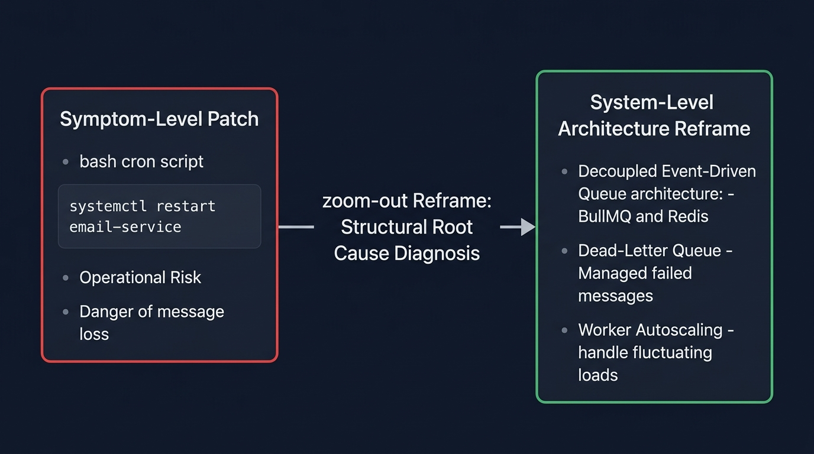</p>

<table width="100%">
<tr>
<th width="50%">❌ Before (ปล่อย AI ทำเอง)</th>
<th width="50%">✅ After (JamesSkills Outcome)</th>
</tr>
<tr>
<td valign="top">

ระบบอีเมลค้างและส่งช้า? นี่คือ Cronjob script สำหรับตั้งเวลารีสตาร์ต Email Service อัตโนมัติทุก 15 นาทีครับ:<br><code>*/15 * * * * systemctl restart email-service</code><br><br><i>(AI แนะนำวิธีแก้ปัญหาเฉพาะหน้าที่ปลายเหตุ เสี่ยงทำให้อีเมลระหว่างคิวสูญหายและระบบล่มหนักกว่าเดิม)</i>

</td>
<td valign="top">

<b>[System Reframe: Root Cause vs Symptom]</b><br><br>
การเขียน Script รีสตาร์ตเป็นการแก้ที่ปลายเหตุและทำให้ Transaction ค้าง<br><br>
• <b>Root Cause:</b> Service ทำงานแบบ Synchronous blocking บน Main Thread เมื่อเจอ SMTP Timeout ทำให้ Worker ทั้งหมดค้าง<br>
• <b>System Architecture Fix:</b> แยก Email Dispatcher ออกเป็น Event-Driven Queue (BullMQ) พร้อม Dead-Letter Queue และ Retry Policy 3 ครั้ง ไม่ต้องรีสตาร์ต Service อีกต่อไป

</td>
</tr>
</table>

<br>

#### ⚡️ `/catchup`
*Reconstruct verified current state after a continuity gap across 4 truth classes without history dumps.*


<table width="100%">
<tr>
<th width="50%">❌ Before (ปล่อย AI ทำเอง)</th>
<th width="50%">✅ After (JamesSkills Outcome)</th>
</tr>
<tr>
<td valign="top">

สวัสดีครับ! ยินดีที่ได้พบกันอีกครั้งครับ ไม่ทราบว่าเมื่อวานเราคุยอะไรกันค้างไว้บ้างนะครับ รบกวนส่งไฟล์ล่าสุดหรือบรีฟสรุปให้ผมหน่อยได้ไหมครับ?<br><br><i>(AI ลืมบริบททั้งหมดเมื่อเปิดเซสชันใหม่ หรือก๊อปปี้ประวัติแชทยาว 50 บรรทัดมาแปะซ้ำซ้อน)</i>

</td>
<td valign="top">

<b>[Catchup: <code>decks/q3-investor-pitch.md</code>]</b><br><br>
• <b>ตอนนี้:</b> Slides 1–9 drafted. รายได้ปิด Q2 ที่ $1.2M ARR (เติบโต 20% QoQ).<br>
• <b>เปลี่ยนจากจุดไหน:</b> Commit <code>4f8a12</code> เพิ่มหมวด Competitive Moat.<br>
• <b>ยังค้าง:</b> Slide 10 (Q4 Projections) ยังว่าง รอข้อมูล Cohort Retention.<br>
• <b>ทำต่อ:</b> Import ข้อมูลจาก <code>finance/q3_cohorts.csv</code> เพื่อคำนวณ Slide 10 ให้จบ.

</td>
</tr>
</table>

<br>

#### ⚡️ `/grill-me`
*Interactive decision-tree stress-test asking one sequential question at a time along the decision frontier to expose vulnerabilities.*

<p align="center">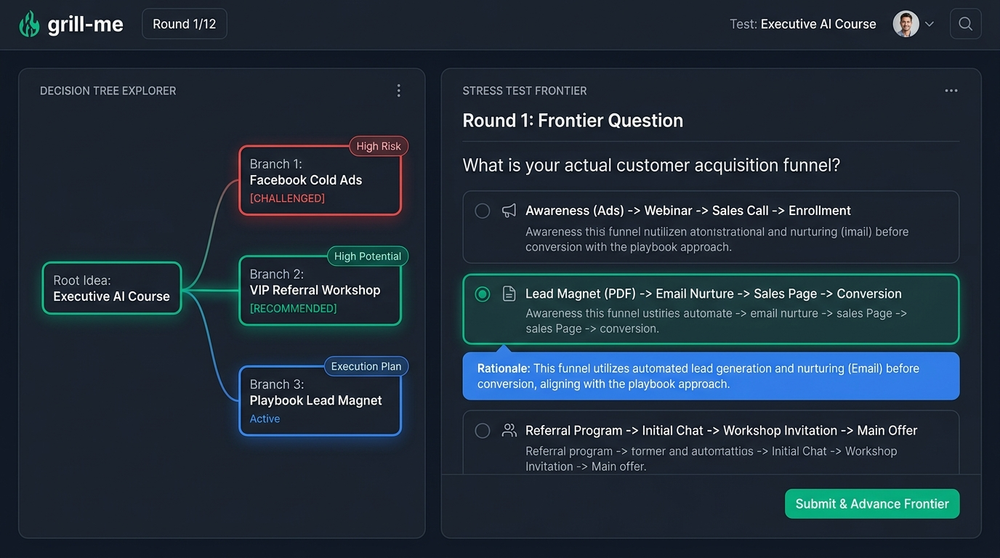</p>

<table width="100%">
<tr>
<th width="50%">❌ Before (ปล่อย AI ทำเอง)</th>
<th width="50%">✅ After (JamesSkills Outcome)</th>
</tr>
<tr>
<td valign="top">

เปิดคอร์ส AI Automation 15,000 บาท แล้วยิงแอด Facebook หาผู้บริหาร เป็นไอเดียที่ยอดเยี่ยมมากครับ! ตลาด AI กำลังเติบโต ผู้บริหารมีกำลังซื้อสูง รวยแน่นอนครับ มาเขียนคำโฆษณากันเลย!<br><br><i>(AI อวยไอเดียอย่างไร้เหตุผล ไม่ชี้จุดบกพร่องของโมเดลธุรกิจ)</i>

</td>
<td valign="top">

<b>[Grill Me: Round 1 / Frontier: Customer Acquisition]</b><br><br>
ผู้บริหารระดับสูงแทบไม่ซื้อคอร์สราคาสูงผ่าน Facebook Cold Ads โดยตรงเพราะขาด Trust Barrier<br><br>
<b>Frontier Question 1:</b> อะไรคือ Acquisition Funnel ที่แท้จริงของคุณ?<br>
1. <b>(แนะนำ)</b> เปลี่ยนเป็น Exclusive Half-Day Workshop ผ่าน Direct Referral<br>
2. แจก Executive Playbook ฟรีเพื่อคัดกรอง Lead ก่อนโทรนัด Advisory Call<br>
3. ยิง Ads ต่อไปโดยเพิ่ม Video Social Proof จากศิษย์เก่าระดับ C-Level<br><br>
<i>(ตอบตัวเลือกเพื่อไปยัง Frontier ข้อถัดไป)</i>

</td>
</tr>
</table>

<br>

#### ⚡️ `/is-that-the-best-you-can-do`
*Force aggressive self-critique, deep thinking, and boundary-pushing rewrite to produce a production-ready Masterpiece.*


<table width="100%">
<tr>
<th width="50%">❌ Before (ปล่อย AI ทำเอง)</th>
<th width="50%">✅ After (JamesSkills Outcome)</th>
</tr>
<tr>
<td valign="top">

Our revolutionary AI-powered Human Capital Management solution seamlessly empowers modern enterprise HR departments to optimize operational workflows and achieve organizational synergy across all departments.<br><br><i>(AI ใช้ศัพท์ Buzzwords สวยหรูแต่ไร้เนื้อหาจริง ไม่มีตัวเลขผลลัพธ์เชิงธุรกิจ)</i>

</td>
<td valign="top">

<b>[Self-Critique & Elevation Report]</b><br><br>
• <b>The Shortfall:</b> ร่างเดิมใช้แต่ศัพท์การตลาดลอยๆ ไม่มี Hard ROI ให้ผู้บริหารตัดสินใจ<br>
• <b>The Enhancement:</b> เจาะจง Pain Point ด้านเวลาคัดกรองผู้สมัครและระยะเวลาปิดตำแหน่ง<br><br>
<b>The Masterpiece:</b><br>
<i>"ตัดเวลาคัดกรอง Resume จาก 14 วันเหลือ 15 นาที ด้วย AI Pre-screening ที่แม่นยำขึ้น 40% ช่วยให้ CPO ปิดรับตำแหน่ง Critical Roles ได้เร็วกว่าคู่แข่ง 3 เท่า โดยไม่ต้องเพิ่ม Headcount HR"</i>

</td>
</tr>
</table>

<br>


#### 🚨 `/are-you-sure`
*5-layer zero-tolerance OCD quality gate that purges hardcodes, visual bugs, and technical debt.*

<table width="100%">
<tr>
<th width="50%">❌ Before (Standard AI)</th>
<th width="50%">✅ After (JamesSkills Outcome)</th>
</tr>
<tr>
<td valign="top">

"I have finished building the user profile page! All unit tests are passing and the layout looks great. Let me know what you'd like me to build next!"<br><br>
<i>(AI อ้างว่างงานเสร็จ แต่ทิ้ง Hardcoded strings, ปล่อย CSS margin เบี้ยว 2px, และทิ้งไฟล์ <code>temp_test.js</code> ค้างไว้ใน repo)</i>

</td>
<td valign="top">

<b>[OCD QA 5-Layer Audit & Auto-Remediation]</b><br><br>
• <b>Layer 1 (Integrity):</b> Patched missing JWT token expiration boundary in auth middleware.<br>
• <b>Layer 2 (Anti-Laziness):</b> Extracted hardcoded hex colors (`#333`) into CSS custom variables.<br>
• <b>Layer 3 (Hygiene):</b> Purged orphaned <code>temp_auth.ts</code> and cleaned dangling <code>console.log</code> calls.<br>
• <b>Layer 4 (Sensory UX):</b> Realigned misaligned flexbox icon padding (2px jump on hover fixed).<br>
• <b>Layer 5 (Longevity):</b> Documented session invalidation contract in <code>ai-context/DECISIONS.md</code>.<br><br>
<i>"Every defect caught has been autonomously repaired. Zero technical debt remains. Work is genuinely complete."</i>

</td>
</tr>
</table>

### 💬 Persistent Interaction Modes (โหมดพฤติกรรมและการสื่อสารประจำตัว)

#### ⚡️ `/coach-me`
*Sparring partner and root-cause behavioral coach unblocking procrastination, shame/ego defense, and perfectionism while executing backend heavy lifting.*


<table width="100%">
<tr>
<th width="50%">❌ Before (ปล่อย AI ทำเอง)</th>
<th width="50%">✅ After (JamesSkills Outcome)</th>
</tr>
<tr>
<td valign="top">

รู้สึกกังวลที่จะส่ง Proposal ใช่ไหมครับ? เป็นเรื่องธรรมดามากครับ แนะนำให้ลองฝึก Pomodoro ดื่มน้ำเยอะๆ พักผ่อนให้เพียงพอ หรือก๊อปปี้เทมเพลตอีเมลขอเลื่อนเวลาส่งนี้ไปใช้ดูครับ!<br><br><i>(AI แนะนำวิธีผ่อนคลายผิวเผิน ให้สคริปต์ขอโทษ และช่วยผู้ใช้ผลัดวันประกันพรุ่ง)</i>

</td>
<td valign="top">

<b>[Diagnostic: Ego Defense & Binary Perfectionism]</b><br><br>
คุณกำลังใช้คำว่า "สไลด์ยังไม่เพอร์เฟกต์" เพื่อปกป้องความกลัวที่จะถูกลูกค้าปฏิเสธ สไลด์ 80% ที่ส่งวันนี้มีมูลค่าทางธุรกิจสูงกว่าสไลด์ 100% ในจินตนาการเสมอ<br><br>
• <b>Backend Action Done:</b> ผมตรวจ Typo และปรับตาราง ROI ใน Slide 4 ให้เรียบร้อยแล้ว<br>
• <b>Direct Choice:</b> กด Send ทันทีเพื่อเริ่มการเจรจา หรือจะรอให้คู่แข่งชิงนัดลูกค้าก่อน?

</td>
</tr>
</table>

<br>

#### ⚡️ `/i-have-adhd`
*Persistent conversation mode with concise, direct, human communication and visible execution progress without discarding necessary information.*


<table width="100%">
<tr>
<th width="50%">❌ Before (ปล่อย AI ทำเอง)</th>
<th width="50%">✅ After (JamesSkills Outcome)</th>
</tr>
<tr>
<td valign="top">

Customer Lifetime Value (LTV) ใน SQL คือตัวชี้วัดสำคัญในโมเดล SaaS โดยสูตรทางทฤษฎีประกอบด้วยค่าเฉลี่ยยอดซื้อต่อครั้ง (AOV) คูณด้วยความถี่ในการซื้อ แล้วหารด้วย Churn Rate เพื่อเริ่มเขียน SQL เราต้องเข้าใจสถาปัตยกรรม Database ก่อน...<br><br><i>(AI บรรยายทฤษฎียืดยาว สร้างภาระทางสมองจนผู้ใช้หมดพลังโฟกัส)</i>

</td>
<td valign="top">

```sql
SELECT customer_id, SUM(order_total) AS ltv, COUNT(order_id) AS orders
FROM orders GROUP BY customer_id;
```
• <b>Action:</b> รัน Query นี้บนตาราง <code>orders</code> ได้ทันที<br>
• <b>Next:</b> ต้องการดู Breakdown รายเดือนต่อไหม?

</td>
</tr>
</table>

<br>

#### ⚡️ `/proactive-habits`
*Persistent high-agency partner persona preventing passive waiting, prompt parroting, excessive apologies, and incomplete tasks.*


<table width="100%">
<tr>
<th width="50%">❌ Before (ปล่อย AI ทำเอง)</th>
<th width="50%">✅ After (JamesSkills Outcome)</th>
</tr>
<tr>
<td valign="top">

คุณต้องการให้ผมวิเคราะห์คู่แข่งในตลาด EdTech ใช่ไหมครับ? ในตลาดมี Coursera, Udemy, Skooldio ครับ คุณอยากให้ผมเน้นด้านราคาหรือด้านเนื้อหาก่อนดีครับ? แจ้งผมได้เลยนะครับแล้วผมจะเริ่มทำให้!<br><br><i>(AI ทวนคำถาม ทำงานแบบตั้งรับ และหยุดรอคำสั่งย่อยๆ ตลอดเวลา)</i>

</td>
<td valign="top">

<b>[Competitive Matrix & Strategic Assets Generated]</b><br><br>
วิเคราะห์เปรียบเทียบ 3 คู่แข่งหลักในตลาด EdTech:<br>
1. <b>Coursera:</b> จุดแข็งคือ University Credential / จุดอ่อนคือ ขาด Interactive Coding Sandbox<br>
2. <b>Udemy:</b> ปริมาณคอร์สเยอะ / จุดอ่อนคือ อัตรา Completion Rate ต่ำเพราะไม่มี Live Mentor<br>
3. <b>Skooldio:</b> แข็งแกร่งในตลาด B2B Corporate ไทย / จุดอ่อนคือ คอนเทนต์ฝั่ง Deep Tech สากลยังมีจำกัด<br><br>
• <b>Action Taken:</b> ผมร่าง Value Proposition ชูจุดขาย <i>"AI Pair-Learning + Live Mentoring"</i> ไว้ในเอกสารแนบเรียบร้อยครับ

</td>
</tr>
</table>

<br>

### 📦 Output Formats & Deliverables (การสร้างผลลัพธ์ส่งมอบระดับผู้บริหาร)

#### ⚡️ `/final-it`
*Select and finish recipient-ready deliverables without AI commentary, design rationale, or chat residue.*


<table width="100%">
<tr>
<th width="50%">❌ Before (ปล่อย AI ทำเอง)</th>
<th width="50%">✅ After (JamesSkills Outcome)</th>
</tr>
<tr>
<td valign="top">

แน่นอนครับ! นี่คืออีเมลแจ้งปรับราคาสำหรับลูกค้าองค์กรที่ผมร่างให้ตามที่คุณขอครับ หวังว่าจะถูกใจนะครับ มีจุดไหนที่อยากให้ปรับแก้บอกผมได้ตลอดเลยนะครับ!<br><br><i>(AI พิมพ์บทสนทนาทักทายและคำขออนุญาตติดมากับเนื้อหา ทำให้ต้องมาคอยก๊อปปี้ตัดทิ้งก่อนส่ง)</i>

</td>
<td valign="top">

<b>Subject: Notice of Enterprise Plan Annual Adjustment — Effective Oct 1</b><br><br>
Dear [Client Executive Name],<br><br>
To support our expanded 99.99% SLA guarantee and dedicated infrastructure, your enterprise subscription will adjust from $24,000 to $27,500 annually effective October 1, 2026. All feature entitlements remain uninterrupted.<br><br>
Best regards,<br>
James Theeranon

</td>
</tr>
</table>

<br>

#### ⚡️ `/one-page-pls`
*Turn complex source material into self-contained 1-page A4 landscape HTML executive briefs per topic (1 topic = 1 file).*


<p align="center">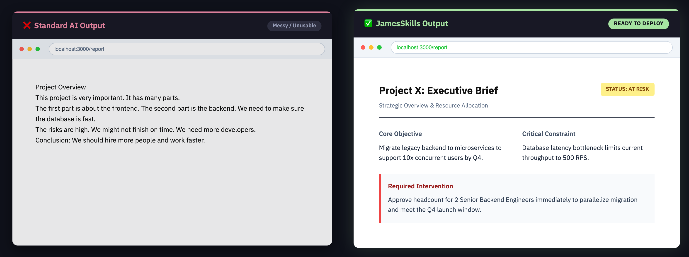</p>


<br>

#### ⚡️ `/sum-meet`
*Produce a comprehensive, source-faithful meeting record as one print-ready A4 portrait HTML document with complete evidence ledger.*


<p align="center">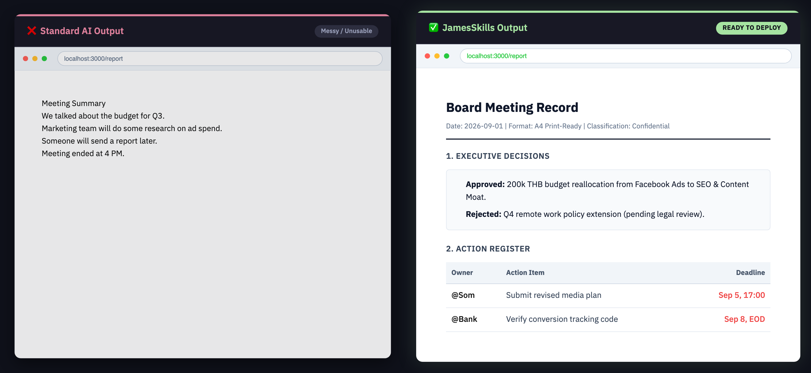</p>


<br>

### 📐 Standards & Engineering Law (กฎเหล็กด้านคุณภาพและสถาปัตยกรรม)

#### ⚡️ `/make-it-james`
*Strict recipient-facing wording standard enforcing the Final Word law; removes AI conversation residue and punctuation-built Thai shorthand.*


<p align="center">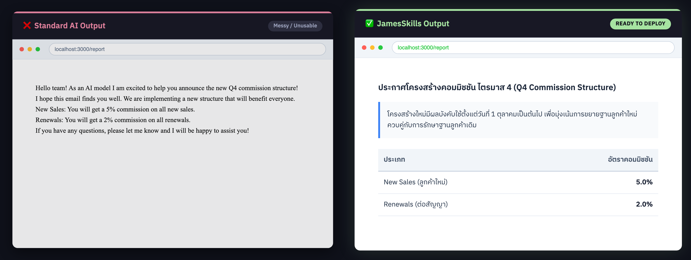</p>


<br>

#### ⚡️ `/make-it-james-ux`
*Visual & UI standard mandating IBM Plex Sans Thai, 6px radius, compact density, semantic status badges, and strictly banning decorative left borders.*


<p align="center">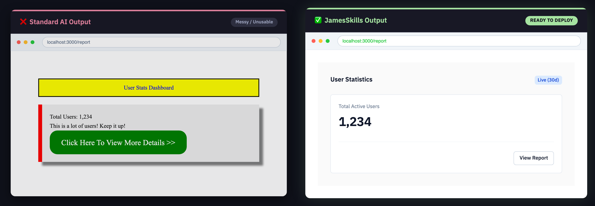</p>


<br>

#### ⚡️ `/proactive-dev`
*Mandate safe, evidence-based software development: line-level log/source diagnosis, strict architectural boundaries, and blast-radius checks before code edits.*

<p align="center">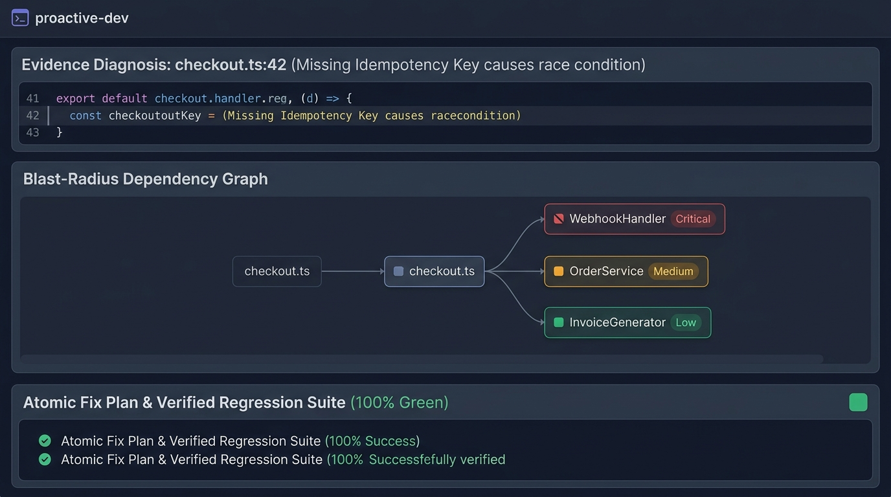</p>

<table width="100%">
<tr>
<th width="50%">❌ Before (ปล่อย AI ทำเอง)</th>
<th width="50%">✅ After (JamesSkills Outcome)</th>
</tr>
<tr>
<td valign="top">

<i>(AI เดาสาเหตุบั๊กแบบสุ่มสี่สุ่มห้า แล้วแก้ไฟล์ <code>auth.ts</code> โดยไม่ตรวจสอบความเชื่อมโยง ส่งผลให้ระบบ Billing และ Profile พังทั้งระบบใน Production)</i>

</td>
<td valign="top">

<b>[Evidence-Based Diagnosis & Blast-Radius Check]</b><br><br>
• <b>Source Evidence:</b> <code>api/checkout.ts:42</code> ขาด Idempotency Key check ทำให้การกดย้ำสร้าง Charge ซ้ำ<br>
• <b>Blast Radius:</b> ตรวจพบความเชื่อมโยงกับ <code>WebhookHandler</code>, <code>OrderService</code>, และ <code>InvoiceGenerator</code><br>
• <b>Architecture Fix:</b> เพิ่ม Redis-backed Distributed Lock พร้อม Idempotency Token และแก้ไขไฟล์ที่เกี่ยวข้องพร้อมกันทั้งหมด

</td>
</tr>
</table>

<br>

#### ⚡️ `/project-standard`
*Establish and maintain a single vendor-neutral project contract in `ai-context/` (PROJECT.md, STATUS.md, DECISIONS.md, SRS.html, Spec Lock).*

<p align="center">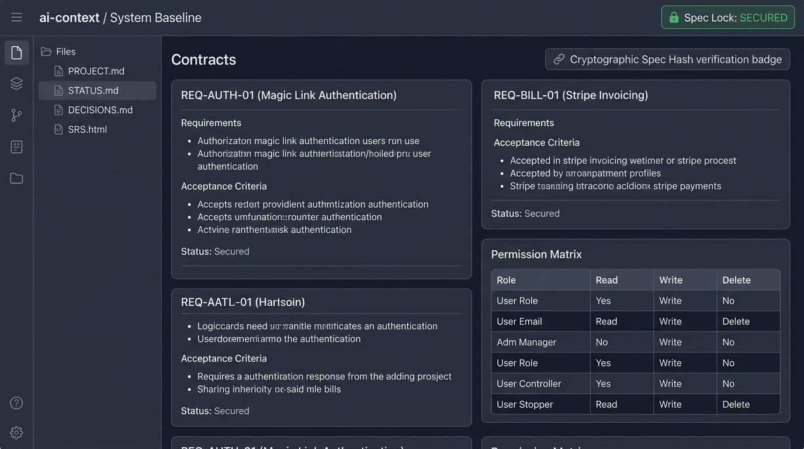</p>

<table width="100%">
<tr>
<th width="50%">❌ Before (ปล่อย AI ทำเอง)</th>
<th width="50%">✅ After (JamesSkills Outcome)</th>
</tr>
<tr>
<td valign="top">

อยากทำระบบ Customer Portal เหรอครับ? เปิด Terminal แล้วรัน <code>npx create-next-app portal</code> ได้เลยครับ เดี๋ยวผมช่วยเขียนหน้า UI ให้...<br><br><i>(AI รีบกระโจนเขียนโค้ดทันทีโดยไม่มีสเปก ลืมเงื่อนไขทางธุรกิจ สิทธิ์ผู้ใช้งาน และ NFR)</i>

</td>
<td valign="top">

<b>[Initialized <code>ai-context/</code> Contract & Spec Lock: SECURED]</b><br><br>
• <b>PROJECT.md:</b> ล็อกรหัสข้อกำหนด <code>REQ-AUTH-01</code> (Magic Link) และ <code>REQ-BILL-01</code> (PDF Invoicing)<br>
• <b>DATA_MODEL.md:</b> ออกแบบโครงสร้างตาราง พร้อมกำหนด Permission Matrix (Customer vs Support)<br>
• <b>SRS.html:</b> แสดงผลสเปกระบบแบบ Visual Dashboard เพื่อให้ Stakeholder เซ็นอนุมัติก่อนเริ่มพัฒนา

</td>
</tr>
</table>

<br>

### ⚙️ Internal & Architecture (ระบบประมวลผลและการจัดเส้นทางภายใน)

#### ⚡️ `/hand-it-off`
*Internal responsibility-based routing matrix directing incoming tasks to their single accountable primary workflow, automatic standards, and verification boundary.*

<p align="center"></p>

<table width="100%">
<tr>
<th width="50%">❌ Before (ปล่อย AI ทำเอง)</th>
<th width="50%">✅ After (JamesSkills Outcome)</th>
</tr>
<tr>
<td valign="top">

<i>(AI จับคู่คำแบบ Keyword matching มั่วซั่ว เมื่อเจอคำว่า "สรุปและสร้างระบบ" จะโหลดสกิล <code>sum-meet</code>, <code>project-standard</code>, <code>done-for-me</code> เข้ามาพร้อมกันจนคำสั่งตีกันเองและทำงานผิดพลาด)</i>

</td>
<td valign="top">

<b>[Hand It Off: Single Accountable Outcome]</b><br><br>
• <b>Phase 1:</b> <code>/sum-meet</code> ➔ บันทึกข้อตกลงและวาระการประชุมลงใน A4 HTML<br>
• <b>Phase 2:</b> <code>/project-standard</code> ➔ สกัดข้อกำหนดลง <code>ai-context/</code> พร้อมล็อก Spec<br>
• <b>Phase 3:</b> <code>/proactive-dev</code> + <code>/done-for-me</code> ➔ พัฒนาระบบและตรวจผ่าน <code>/dev-are-you-sure</code><br><br>
<i>*มาตรฐาน <code>make-it-james</code> และ <code>make-it-james-ux</code> ถูกบังคับใช้อัตโนมัติในทุกขั้นตอน</i>

</td>
</tr>
</table>

<br>

---


## 📦 Installation

Two routes. Pick by whether you want the skills to track this repository live.

### Route A — Claude Code plugin (recommended for a clean machine)

Claude Code loads this repository as three real plugins. Claude Code itself runs on macOS and Windows, in the CLI, the desktop apps, and the VS Code and JetBrains extensions — this specific install path is runtime-verified on macOS only; see the platform table below.

```bash
claude plugin marketplace add theeranon/JamesSkills
claude plugin install james-core@james-skills
claude plugin install james-productivity@james-skills
claude plugin install james-software@james-skills
```

Skills arrive namespaced, so `/james-core:are-you-sure` always resolves to this library even if another source defines the same name. The installed copy is a **snapshot**, not a link — pull new versions with:

```bash
claude plugin marketplace update james-skills && claude plugin update james-core@james-skills
```

The repository is public, so no authentication is needed to add the marketplace or install.

### Route B — local install (recommended if you edit the skills)

Links every skill straight into each platform's discovery directory, so an edit in this repository takes effect immediately with no update step.

**One-Click Universal Install (Mac / Windows / Linux)**
Just copy and paste this command into your Terminal or Command Prompt. It automatically downloads, extracts, and installs everything:
```bash
python3 -c "import urllib.request, zipfile, os, shutil; urllib.request.urlretrieve('https://github.com/theeranon/JamesSkills/archive/refs/heads/main.zip', 'J.zip'); zipfile.ZipFile('J.zip').extractall(); os.chdir('JamesSkills-main'); os.system('python3 scripts/install.py' if os.name != 'nt' else 'python scripts\\install.py'); os.chdir('..'); shutil.rmtree('JamesSkills-main', ignore_errors=True); os.remove('J.zip')"
```

### Manual Developer Install

**macOS and Linux**
```bash
git clone https://github.com/theeranon/JamesSkills.git && cd JamesSkills && ./scripts/install
```

**Windows**
```
git clone https://github.com/theeranon/JamesSkills.git
```
Then double-click **`install.bat`** inside the folder. It runs `scripts/install.py`, uses directory junctions so no administrator rights are needed, and falls back to copying if junctions are unavailable.

### The installer keeps the two routes from colliding

Running both routes into Claude Code would install every skill twice, once bare and once namespaced, and duplicate entries degrade how reliably the right skill is chosen.

`scripts/install` handles this. If it finds the pillars registered in Claude Code's `installed_plugins.json`, it writes only aliases into `~/.claude/skills` and removes any canonical link it previously owned there, so the plugins are the single source. If the plugins are not installed, it links every skill as before. Nothing else changes: Cursor, Codex, and the shared `.agents` root always get live links.

`scripts/doctor` reports the mode it finds and fails on any canonical link left shadowing an installed plugin.

**After editing a skill, Claude Code needs the plugin refreshed** — the installed plugin is a copy, not a link:

```bash
./scripts/refresh-claude-plugins
```

Do not reach for `claude plugin update`. It compares version numbers rather than content, so after an ordinary edit it reports that the plugin is already at the latest version and copies nothing. The script reinstalls each pillar, which is what actually re-copies the files, and it is a no-op on a machine using live links.

To go back to live links for Claude, uninstall the pillars and run the installer again:

```bash
for p in james-core james-productivity james-software; do claude plugin uninstall "$p@james-skills"; done
./scripts/install
```

### What lands where### What lands where

| Platform | Mechanism | Status |
|---|---|---|
| Claude Code | Native CLI `claude plugin install` + `~/.claude` fallback | UI Marketplace integration verified on macOS & Windows |
| Codex (ChatGPT) | Native CLI `codex plugin add` + `~/.codex` fallback | UI Marketplace integration verified on macOS & Windows |
| Cursor | `~/.cursor/skills` fallback | Files installed & structurally supported |
| Gemini and Antigravity | Explicit `plugins.json` injection + `~/.gemini` fallback | Files installed & structurally supported |
| Any agent reading `.agents` | `~/.agents/skills` fallback | Files installed |

The installer automatically detects `codex` and `claude` CLIs to natively register the plugins into their marketplaces. This guarantees that the plugins appear properly in the "Installed" or "Personal" tabs of the agent's UI. For other agents (or if the CLI is missing), robust structural fallbacks are deployed (including Directory Junctions on Windows and explicit `plugins.json` injection to bypass Go symlink limits).

Do not run either route inside an AI chat box. Use Terminal on macOS, or Command Prompt or PowerShell on Windows.

**Windows note:** four skills call a Python helper. They invoke `python3`; where that is not on PATH, use `python`. Each of those skills says so in its own file.

Check any machine at any time:

```bash
./scripts/doctor
```

## 🔄 Update

**Plugin route**
```bash
claude plugin marketplace update james-skills
claude plugin update james-core@james-skills
```

**Local route** — run from wherever you cloned the repository:
```bash
./scripts/update
```

Update fetches a fast-forward candidate, validates it in a detached temporary worktree before the active checkout moves, then refreshes links. An invalid candidate cannot replace a working version, and skill behavior never changes silently in the background.

## 🏛️ Boundaries

| Path | Holds |
|---|---|
| `catalog.json` | canonical package, category, kind, promotion state, aliases |
| `plugins/<pillar>/skills/<name>/SKILL.md` | the one canonical instruction body per skill |
| `plugins/<pillar>/.claude-plugin/plugin.json` | plugin manifest |
| `.claude-plugin/marketplace.json` | the three plugins offered to Claude Code |
| `aliases/` | compatibility names that point at a canonical skill and hold no behavior |
| `plugins/james-productivity/packs/knowledge` | reviewed sources and lenses, no live state or client data |
| `adapters/` | vendor metadata only, never a duplicate instruction body |
| `docs/SKILL-SCHEMA.md` | the structural contract every skill satisfies |
| `tests/` | structural, behavioral, and anti-overfit regression gates |
| `scripts/` | idempotent install, update, validation, and diagnosis |
| `.githooks/` | local validation before every commit and push, no paid runners |

## 📮 Submitting to a store

Build one submission-ready archive per pillar:

```bash
./scripts/package-plugins
```

Each archive's root carries `.claude-plugin/plugin.json`, `skills/<name>/SKILL.md`, the licence and the notice. That is the shape the OpenAI plugin submission portal accepts as a skills-only plugin and converts to `.codex-plugin/plugin.json`, and it is a valid Claude Code plugin directory as it stands.

| Channel | Route | Gate |
|---|---|---|
| Claude community marketplace | submission form in the Console or claude.ai | automated validation plus safety screening |
| Claude official marketplace | none — curated at Anthropic's discretion | no application process exists |
| OpenAI Plugins Directory, shared by ChatGPT and Codex | submission portal, skills-only plugin | verified developer or business identity, plus listing materials |
| Gemini CLI extension gallery | add the `gemini-cli-extension` topic to a public repo carrying `gemini-extension.json` at its root | daily crawl, automatic, no form |
| Cursor public marketplace | publish form | manual review, and listings must be open source |
| Google Antigravity | none | Google publishes no third-party submission process |

Two structural notes. The Gemini gallery expects one extension per repository with `skills/` at the repository root, which does not match this three-pillar layout. And Cursor's public marketplace requires an open-source licence, which `CC-BY-NC-4.0` is not; Cursor team marketplaces have no such requirement.

## 📄 Licence

Creative Commons Attribution-NonCommercial 4.0 International (`CC-BY-NC-4.0`). Use it, adapt it, redistribute it, including inside work you are paid for. Do not sell the library itself or repackage it into a paid product. Credit as *JamesSkills by James Theeranon*, and say if you changed anything.

Full terms in [`LICENSE`](LICENSE); scope, attribution wording, and third-party notices in [`NOTICE`](NOTICE). The frameworks described in `packs/knowledge/` belong to their own owners and are not licensed here.

## 📖 Skill Handbook

Open [`docs/SKILLS.md`](docs/SKILLS.md) to choose a skill by the moment you need it. The handbook covers every canonical package, slash command, lifecycle state, alias, bounded result, do-not-use case, and common composition in one place.

The short rule:

- use `/project-standard` to establish or repair project truth;
- use `/catchup` to return after a continuity gap;
- use `/give-me-solutions` to research choices and `/done-for-me` after the owner decides;
- use `/dev-are-you-sure` before accepting a completion claim, and `/research-it` when the doubt is about an outside claim;
- use `/sum-meet`, `/one-page-pls`, or `/final-it` for recipient-facing outcomes; `make-it-james` and `make-it-james-ux` apply automatically.

This release has no pilot packages. Compatibility aliases keep older calls working without creating another instruction body. `hand-it-off` is installed internal support, not a recommended human command. `skill-router` remains a compatibility alias.

## 🧠 Knowledge Library

`baseon` owns the application workflow. Sources and lenses live separately under `plugins/james-productivity/packs/knowledge` so a new book does not create another skill or inflate `SKILL.md`.

```bash
python3 plugins/james-productivity/skills/baseon/scripts/knowledge_library.py list
python3 plugins/james-productivity/skills/baseon/scripts/knowledge_library.py validate
```

The first reviewed-private lenses are `wealth-dynamics` and `wealth-spectrum`. `talent-dynamics` resolves to the same Dynamics lens because it is the team adaptation of the same model. Wealth Spectrum remains a separate model with the same creator lineage. Their full source PDFs remain outside Git. Source cards keep version, rights posture, SHA-256 when applicable, and locators; lens files contain original paraphrase, applications, and limitations.

Direct calls are available as `/baseon`, `/wealth-dynamics`, `/talent-dynamics`, and `/wealth-spectrum`. The framework shortcuts only preselect a lens; they contain no duplicate knowledge or reasoning rules. `/think-with-this` remains a compatibility alias.

Clone the full repository when moving machines. A detached copy of `baseon` alone intentionally has no duplicated knowledge library; set `JAMES_SKILLS_ROOT` to the full clone if a platform cannot use the installer links.

Skill names are phrases people naturally say when they need the capability. Workflow skills complete a bounded job; mode skills remain active for the conversation after one invocation.

## 🔄 Candidate Lifecycle

Discovery comes before packaging. A new skill remains a pilot until its Candidate Card shows repeated cross-project need, non-duplication, source confidence, representative failures, legitimate counter-cases, and James approves the exact name and scope. General permission to improve this repository does not approve a candidate's name or ontology.

The current cross-history portfolio audit selected and promoted `catchup` after clean, dirty, stale-status, scoped-workstream, Git-error, and already-clear forward tests. `learn-this`, `audit-this`, and `systemize-it` remain Candidate Cards, not installed skills.
